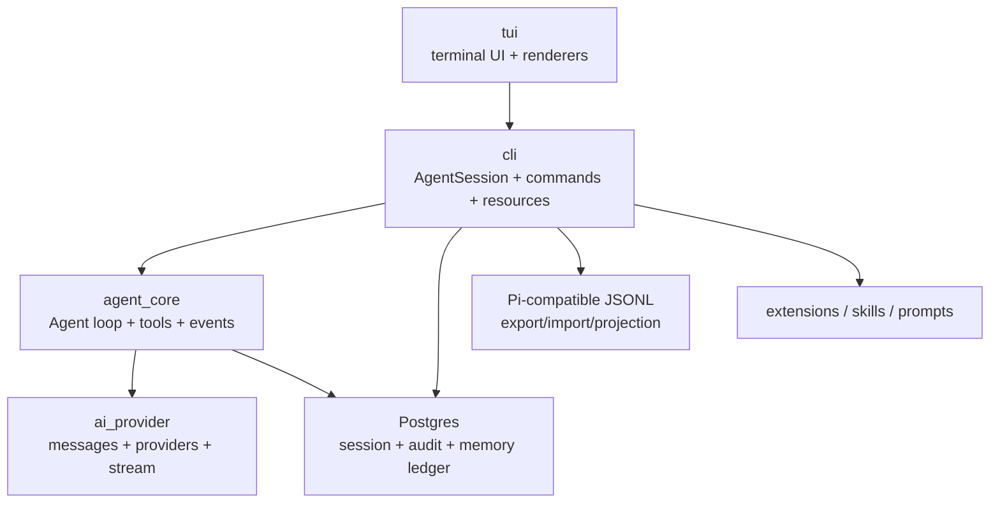

# P1 Pi CLI Technical Architecture

## 状态

- Status: accepted
- Date: 2026-04-25
- Roadmap: `design_docs/roadmap/p1_engine_pi.md`
- Reference repo: [badlogic/pi-mono](https://github.com/badlogic/pi-mono)
- Reference baseline: [main@97a38bf6](https://github.com/badlogic/pi-mono/tree/97a38bf6)
- Scope: Python 复刻 Pi CLI 产品语义，不绑定 Node.js runtime。

本文件把 P1 路线图中“后续 Architecture 文档待拆分”的内容先收敛成一个可执行的技术架构基线。P1 实现应优先复刻 Pi mono 中已经被真实项目验证过的协议、接口和事件顺序；只有在 NeoMAGI 的 Postgres truth、policy、audit、memory 约束需要时才做语义改造。

## Source Map

Pi mono source paths below are repository-relative paths under [badlogic/pi-mono](https://github.com/badlogic/pi-mono/tree/97a38bf6), not local filesystem paths.

| 主题 | Pi mono 来源 |
| --- | --- |
| message / content block / assistant stream | `packages/ai/src/types.ts`, `packages/ai/src/stream.ts`, `packages/ai/src/utils/event-stream.ts` |
| provider / model registry | `packages/ai/src/models.ts`, `packages/ai/src/api-registry.ts`, `packages/coding-agent/src/core/model-registry.ts` |
| prompt cache / overflow | `packages/ai/src/types.ts`, `packages/ai/src/providers/anthropic.ts`, `packages/ai/src/providers/openai-responses.ts`, `packages/ai/src/providers/openai-completions.ts`, `packages/ai/src/providers/amazon-bedrock.ts`, `packages/ai/src/providers/faux.ts`, `packages/ai/src/utils/overflow.ts`, `packages/agent/src/agent.ts`, `packages/agent/src/agent-loop.ts`, `packages/coding-agent/src/core/sdk.ts` |
| agent state / event / loop | `packages/agent/src/types.ts`, `packages/agent/src/agent.ts`, `packages/agent/src/agent-loop.ts` |
| coding session / SDK | `packages/coding-agent/src/core/agent-session.ts`, `packages/coding-agent/src/core/sdk.ts`, `packages/coding-agent/src/core/agent-session-runtime.ts` |
| session JSONL schema | `packages/coding-agent/src/core/session-manager.ts`, `packages/coding-agent/docs/session.md` |
| coding tools | `packages/coding-agent/src/core/tools/*.ts` |
| extension API | `packages/coding-agent/src/core/extensions/types.ts`, `packages/coding-agent/docs/extensions.md` |
| resources / skills / prompts | `packages/coding-agent/src/core/resource-loader.ts`, `prompt-templates.ts`, `skills.ts`, `package-manager.ts` |
| settings / auth | `packages/coding-agent/src/core/settings-manager.ts`, `auth-storage.ts` |
| compaction / branch summary | `packages/coding-agent/src/core/compaction/*.ts`, `packages/coding-agent/docs/compaction.md` |
| TUI | `packages/tui/src/*`, `packages/tui/README.md` |
| RPC / JSON mode | `packages/coding-agent/src/modes/rpc/rpc-types.ts`, `docs/rpc.md`, `docs/json.md` |

## Architecture Position

P1 是 NeoMAGI 的本地终端主产品，不只是底层 agent engine。架构分四层：



Recommended Python package layout:

| Package | Responsibility |
| --- | --- |
| `ai_provider` | Pi-compatible message/content/tool/model/provider/stream types, provider adapters, faux provider, credential resolution boundary |
| `agent_core` | `Agent`, `AgentState`, turn loop, tool execution, event subscription, steering/follow-up queues |
| `cli.core` | `AgentSession`, session lifecycle, resource loader, settings/auth/model registry, commands, compaction |
| `cli.tools` | built-in coding tools and tool render metadata |
| `cli.extensions` | Python extension API mirroring Pi semantics |
| `tui` | terminal lifecycle, editor, overlays, selectors, markdown, tool/message rendering |
| `storage` | Postgres repositories, JSONL import/export, audit writer |
| `policy` | path/shell/network/memory permission evaluation and sandbox adapters |

## Compatibility Strategy

Directly borrow:

- `Message`, `ContentBlock`, `ToolCall`, `Usage`, `StopReason`, `AssistantMessageEvent`.
- `AgentEvent` names, payload shapes, and event order.
- `Agent.prompt() / continue() / abort() / wait_for_idle()` semantics.
- tool definition shape: name, label, description, schema, execution mode, streaming updates, render metadata.
- session entry names and tree semantics: `id`, `parentId`, leaf, branch, compaction, labels.
- extension event names, UI primitives, command/tool/resource registration concepts.
- compaction and branch summary structure.
- RPC JSONL framing and command/response/event split.

Adapt for NeoMAGI:

- Postgres is durable truth for session, tool execution, compaction, branch summary, audit, and memory-write side effects.
- Pi JSONL is import/export/projection, not production truth.
- all shell/file/network/memory/task mutations must pass through one policy/audit boundary.
- provider-hosted thread state is cache only; it never becomes NeoMAGI truth.
- extensions cannot get unmediated access to privileged actions. Their registered tools go through the same registry, policy, timeout, sandbox, truncation, and audit path.

## `ai_provider` Protocol

### Content Blocks

Python types should stay wire-compatible with Pi:

```python
TextContent = {"type": "text", "text": str, "textSignature"?: str}
ThinkingContent = {"type": "thinking", "thinking": str, "thinkingSignature"?: str, "redacted"?: bool}
ImageContent = {"type": "image", "data": base64_str, "mimeType": str}
ToolCall = {
    "type": "toolCall",
    "id": str,
    "name": str,
    "arguments": dict,
    "thoughtSignature"?: str,
}
```

Rules:

- `TextContent`, `ImageContent`, `ThinkingContent`, and `ToolCall` are serializable JSON objects.
- provider-specific opaque continuation metadata belongs in `textSignature`, `thinkingSignature`, `thoughtSignature`, or `responseId`; do not normalize it away.
- `ImageContent.data` is base64 only; file paths are not valid message content.

### Messages

```python
UserMessage = {
    "role": "user",
    "content": str | list[TextContent | ImageContent],
    "timestamp": int,  # Unix ms
}

AssistantMessage = {
    "role": "assistant",
    "content": list[TextContent | ThinkingContent | ToolCall],
    "api": str,
    "provider": str,
    "model": str,
    "responseId"?: str,
    "usage": Usage,
    "stopReason": "stop" | "length" | "toolUse" | "error" | "aborted",
    "errorMessage"?: str,
    "timestamp": int,
}

ToolResultMessage = {
    "role": "toolResult",
    "toolCallId": str,
    "toolName": str,
    "content": list[TextContent | ImageContent],
    "details"?: Any,
    "isError": bool,
    "timestamp": int,
}
```

`Usage`:

```python
Usage = {
    "input": int,
    "output": int,
    "cacheRead": int,
    "cacheWrite": int,
    "totalTokens": int,
    "cost": {
        "input": float,
        "output": float,
        "cacheRead": float,
        "cacheWrite": float,
        "total": float,
    },
}
```

Implementation notes:

- `timestamp` uses Unix milliseconds for Pi-compatible messages.
- `AssistantMessage.usage.cost` is computed from model cost per million tokens.
- failed provider/runtime calls should produce an `AssistantMessage` with `stopReason: "error"` or `"aborted"` and an `errorMessage`, then end through the normal stream protocol.

### Context and Tools

```python
Tool = {
    "name": str,
    "description": str,
    "parameters": dict,  # JSON Schema / TypeBox-compatible object
}

Context = {
    "systemPrompt"?: str,
    "messages": list[Message],
    "tools"?: list[Tool],
}
```

P1 should use JSON Schema validation for tool arguments. Validation errors become error `ToolResultMessage` content; they must not crash the agent loop.

### Assistant Stream

`AssistantMessageEvent` is the first cross-layer contract TUI must consume:

```python
AssistantMessageEvent =
  {"type": "start", "partial": AssistantMessage}
| {"type": "text_start", "contentIndex": int, "partial": AssistantMessage}
| {"type": "text_delta", "contentIndex": int, "delta": str, "partial": AssistantMessage}
| {"type": "text_end", "contentIndex": int, "content": str, "partial": AssistantMessage}
| {"type": "thinking_start", "contentIndex": int, "partial": AssistantMessage}
| {"type": "thinking_delta", "contentIndex": int, "delta": str, "partial": AssistantMessage}
| {"type": "thinking_end", "contentIndex": int, "content": str, "partial": AssistantMessage}
| {"type": "toolcall_start", "contentIndex": int, "partial": AssistantMessage}
| {"type": "toolcall_delta", "contentIndex": int, "delta": str, "partial": AssistantMessage}
| {"type": "toolcall_end", "contentIndex": int, "toolCall": ToolCall, "partial": AssistantMessage}
| {"type": "done", "reason": "stop" | "length" | "toolUse", "message": AssistantMessage}
| {"type": "error", "reason": "aborted" | "error", "error": AssistantMessage}
```

Rules:

- stream always emits `start` before any delta, thinking, or tool-call event. A provider with no partial output emits `start` then `done` directly. Consumers may rely on `start` being the first event of every assistant turn.
- `partial` is the full current assistant message snapshot, not only the delta.
- final event is exactly one of `done` or `error`.
- `result()` / equivalent async finalizer returns the same final `AssistantMessage` carried by `done.message` or `error.error`.

### Model and Provider

```python
Model = {
    "id": str,
    "name": str,
    "api": str,
    "provider": str,
    "baseUrl": str,
    "reasoning": bool,
    "input": list["text" | "image"],
    "cost": {"input": float, "output": float, "cacheRead": float, "cacheWrite": float},
    "contextWindow": int,  # required for silent overflow recovery and auto compaction
    "maxTokens": int,
    "headers"?: dict[str, str],
    "compat"?: dict,
}
```

`StreamOptions` should include `temperature`, `maxTokens`, `signal`, `apiKey`, `transport`, `cacheRetention`, `sessionId`, `onPayload`, `onResponse`, `headers`, `maxRetryDelayMs`, and provider metadata. `SimpleStreamOptions` adds `reasoning` and `thinkingBudgets`.

Prompt cache contract:

- `cacheRetention` is `none | short | long`; default is `short`. A compatibility env/config value equivalent to Pi's `PI_CACHE_RETENTION=long` may promote default retention to `long`.
- Pi `sessionId` is the provider cache affinity parameter passed from `AgentSession` through `Agent` / agent loop into each provider call. NeoMAGI should distinguish the durable Postgres `session_id` from the provider `cache_affinity_id`; the default mapping may be the durable id only if it satisfies provider length/charset rules, otherwise use a stable sanitized or hashed value. `resume` keeps the affinity id; `new` / `fork` / `clone` must explicitly define whether they keep or mint it.
- `cacheRetention == "none"` disables all provider cache/session propagation: do not pass `sessionId`, `prompt_cache_key`, `cache_control`, `cachePoint`, `prompt_cache_retention`, or affinity headers. This is a stronger contract than merely omitting provider-specific cache annotations.
- OpenAI Responses and direct OpenAI Chat Completions map `sessionId` to `prompt_cache_key`; `long` maps to provider retention such as `24h` where supported.
- OpenAI-compatible providers may also receive session affinity through HTTP headers when `compat.sendSessionAffinityHeaders == true`: `session_id`, `x-client-request-id`, and `x-session-affinity` all carry the provider cache affinity id. This header path coexists with field-based `prompt_cache_key` where the provider supports both.
- Anthropic maps retention to `cache_control` on system prompt, last tool definition, and last user/assistant text block; direct Anthropic `long` maps to a longer TTL where supported.
- OpenAI-compatible providers may opt into Anthropic-style `cache_control` through model/provider compat metadata.
- Bedrock Converse maps retention to `cachePoint` blocks for supported Claude models.
- Faux/test provider should simulate prompt cache by stable `sessionId` and common-prefix accounting so cache fixtures run without real provider calls.
- Prompt cache state remains provider-side optimization. NeoMAGI persists settings, affinity ids, request metadata, and returned usage/cost only; it must not treat provider cache contents as durable truth.
- Usage normalization must keep Pi semantics: `input` excludes `cacheRead` and `cacheWrite`; `totalTokens = input + output + cacheRead + cacheWrite`. Provider adapters must subtract cached tokens before adding `cacheRead` / `cacheWrite`, because OpenAI-compatible and proxy providers often report `prompt_tokens_details.cached_tokens` while also including those tokens in `prompt_tokens`. Lock this with one raw-usage-to-normalized-usage fixture per provider family.

Overflow and context-window contract:

- `model.contextWindow` is required for custom models. It drives auto compaction thresholds and silent overflow detection; leaving it unset or inaccurate disables one of Pi's recovery paths.
- Overflow detection has two paths: provider error messages matching Pi's overflow pattern set, and silent overflow when `AssistantMessage.stopReason == "stop"` while `usage.input + usage.cacheRead > model.contextWindow`.
- Non-overflow errors such as rate limits, throttling, and temporary service availability are explicitly excluded from overflow matching; otherwise retry logic can compact forever on transient capacity failures.
- Python must mirror Pi's `OVERFLOW_PATTERNS` and `NON_OVERFLOW_PATTERNS` sets as versioned fixtures, including Anthropic, OpenAI, Google, xAI, Groq, OpenRouter, Bedrock, llama.cpp, LM Studio, Copilot, MiniMax, Kimi, Mistral, Cerebras, Ollama, and z.ai variants.

Provider registry contract:

- register by API family, not only by vendor.
- `stream(model, context, options)` and `stream_simple(model, context, options)` return `AssistantMessageEventStream`.
- custom provider registration can include `streamSimple`, `oauth`, models, headers, `authHeader`, base URL, and API family.
- model registry merges built-ins, config-file overrides, extension-registered providers, and runtime overrides.

Credential resolution order should mirror Pi while respecting NeoMAGI secret handling:

1. runtime API key override;
2. auth storage API key;
3. OAuth token from auth storage, auto-refreshed under lock;
4. environment variable;
5. custom provider fallback resolver.

## `agent_core` Protocol

### Agent State

```python
AgentState = {
    "systemPrompt": str,
    "model": Model,
    "thinkingLevel": "off" | "minimal" | "low" | "medium" | "high" | "xhigh",
    "tools": list[AgentTool],
    "messages": list[AgentMessage],
    "isStreaming": bool,
    "streamingMessage"?: AgentMessage,
    "pendingToolCalls": set[str],
    "errorMessage"?: str,
}
```

`AgentMessage` is standard `Message` plus app-specific custom roles. P1 should include Pi coding roles:

- `bashExecution`
- `custom`
- `branchSummary`
- `compactionSummary`

`transform_context(messages, signal)` runs at `AgentMessage` level. `convert_to_llm(messages)` converts to `Message[]` at provider boundary.

Default boundary behavior:

- `agent_core` should use Pi's safe default: `convert_to_llm()` only forwards `user`, `assistant`, and `toolResult` messages.
- `cli.core` / coding-agent layer owns product-specific conversion for `bashExecution`, `custom`, `branchSummary`, and `compactionSummary`, usually by turning them into synthetic user-visible context or dropping them when they should not reach the model.

### Agent API

```python
class Agent:
    state: AgentState
    tool_execution: "parallel" | "sequential"
    steering_mode: "all" | "one-at-a-time"
    follow_up_mode: "all" | "one-at-a-time"

    async def prompt(input: str | AgentMessage | list[AgentMessage], images: list[ImageContent] | None = None) -> None: ...
    async def continue_(self) -> None: ...
    def steer(message: AgentMessage) -> None: ...
    def follow_up(message: AgentMessage) -> None: ...
    def abort() -> None: ...
    async def wait_for_idle() -> None: ...
    def subscribe(listener: Callable[[AgentEvent, AbortSignal], Awaitable[None] | None]) -> Unsubscribe: ...
    def reset() -> None: ...
```

Semantics to preserve:

- `prompt()` fails if already streaming; during streaming callers use `steer()` or `follow_up()`.
- `continue_()` requires the last LLM-convertible message to be `user` or `toolResult`; it cannot continue from a bare assistant message unless queued steering/follow-up exists.
- `isStreaming` remains true until awaited `agent_end` listeners finish.
- `agent_end` is the final event, but settlement happens after its listeners complete.

### Agent Events

```python
AgentEvent =
  {"type": "agent_start"}
| {"type": "agent_end", "messages": list[AgentMessage]}
| {"type": "turn_start"}
| {"type": "turn_end", "message": AgentMessage, "toolResults": list[ToolResultMessage]}
| {"type": "message_start", "message": AgentMessage}
| {"type": "message_update", "message": AgentMessage, "assistantMessageEvent": AssistantMessageEvent}
| {"type": "message_end", "message": AgentMessage}
| {"type": "tool_execution_start", "toolCallId": str, "toolName": str, "args": Any}
| {"type": "tool_execution_update", "toolCallId": str, "toolName": str, "args": Any, "partialResult": Any}
| {"type": "tool_execution_end", "toolCallId": str, "toolName": str, "result": Any, "isError": bool}
```

Base event order for prompt without tools:

```text
agent_start
turn_start
message_start(user)
message_end(user)
message_start(assistant)
message_update(assistant, assistantMessageEvent)*
message_end(assistant)
turn_end
agent_end
```

With tools:

```text
agent_start
turn_start
message_start/end(user)
message_start/update*/message_end(assistant with toolCall)
tool_execution_start*
tool_execution_update*
tool_execution_end*
message_start/end(toolResult)*
turn_end
turn_start
message_start/update*/message_end(assistant)
turn_end
agent_end
```

Tool execution modes:

- `parallel` default: preflight tool calls sequentially, execute allowed tools concurrently, emit `tool_execution_end` as tools finish, then emit `toolResult` messages in assistant source order.
- `sequential`: execute and persist each tool one by one.
- if any tool in a batch declares `executionMode: "sequential"`, the whole batch is sequential.

Hooks:

- `before_tool_call(context, signal)` runs after argument preparation and schema validation; `{block: true, reason}` creates an error tool result.
- `after_tool_call(context, signal)` runs after execution and before `tool_execution_end`; it can replace `content`, `details`, or `isError`.

Errors:

- unknown tool, validation failure, policy block, execution exception, and after-hook exception all become `ToolResultMessage(isError=True)`.
- tool errors are returned to the model; they do not abort the loop.
- provider/runtime errors become assistant messages with `stopReason: "error"` or `"aborted"`.

## `cli.core` Product Contract

### AgentSession

`AgentSession` coordinates resource context, session persistence, model/settings changes, extension binding, tool registry, compaction, and product commands.

Core API:

```python
class AgentSession:
    agent: Agent
    session_manager: SessionManager
    settings_manager: SettingsManager
    resource_loader: ResourceLoader
    model_registry: ModelRegistry

    def subscribe(listener: Callable[[AgentSessionEvent], None]) -> Unsubscribe: ...
    async def prompt(text: str, options: PromptOptions | None = None) -> None: ...
    async def steer(text: str, images: list[ImageContent] | None = None) -> None: ...
    async def follow_up(text: str, images: list[ImageContent] | None = None) -> None: ...
    async def abort() -> None: ...
    async def set_model(model: Model) -> None: ...
    def set_thinking_level(level: ThinkingLevel) -> None: ...
    async def compact(custom_instructions: str | None = None) -> CompactionResult: ...
    async def reload() -> None: ...
    async def execute_bash(command: str, exclude_from_context: bool = False) -> BashResult: ...
    async def navigate_tree(target_id: str, summarize: bool = True, ...) -> TreeNavigationResult: ...
    def export_to_jsonl(output_path: str | None = None) -> str: ...
```

`PromptOptions`:

- `expandPromptTemplates?: bool`
- `images?: list[ImageContent]`
- `streamingBehavior?: "steer" | "followUp"`
- `source?: "interactive" | "rpc" | "extension"`

`AgentSessionEvent` extends `AgentEvent` with:

```python
{"type": "queue_update", "steering": list[str], "followUp": list[str]}
{"type": "compaction_start", "reason": "manual" | "threshold" | "overflow"}
{"type": "compaction_end", "reason": ..., "result": CompactionResult | None, "aborted": bool, "willRetry": bool, "errorMessage"?: str}
{"type": "auto_retry_start", "attempt": int, "maxAttempts": int, "delayMs": int, "errorMessage": str}
{"type": "auto_retry_end", "success": bool, "attempt": int, "finalError"?: str}
```

### Slash Commands

Built-in commands to carry over:

| Command | P1 semantics |
| --- | --- |
| `/settings` | open settings UI |
| `/model` | model selector |
| `/scoped-models` | configure Ctrl+P cycling scope |
| `/export` | export HTML or JSONL based on path extension |
| `/import` | import JSONL projection into durable session |
| `/copy` | copy last assistant message |
| `/name` | append session display-name entry |
| `/session` | show stats |
| `/hotkeys` | show keybindings |
| `/fork` | create new fork from previous user message |
| `/clone` | duplicate active branch into new session |
| `/tree` | navigate session tree |
| `/login`, `/logout` | OAuth auth |
| `/new` | new session |
| `/compact` | manual compaction |
| `/resume` | select previous session |
| `/reload` | reload keybindings/resources/extensions |
| `/quit` | exit |

Command resolution priority is `builtin > extension > prompt template > skill namespace`. `/skill:name` is an independent namespace and does not conflict with built-ins or extension commands; `enableSkillCommands` is the global switch for registering skills as slash commands and defaults to `true`. Extension commands may run immediately even while streaming. Skill/template commands are expanded before prompt/steer/follow-up delivery. Queued messages must reject extension commands unless called via `prompt()`.

## Durable Session Architecture

### Pi-Compatible Entry Schema

Keep Pi entry names for import/export:

```python
SessionHeader = {
    "type": "session",
    "version": 3,
    "id": uuid,          # Pi session id is uuidv7-shaped
    "timestamp": iso8601,
    "cwd": str,
    "parentSession"?: str,
}

SessionEntryBase = {
    "type": str,
    "id": str,           # Pi uses short 8-char IDs; NeoMAGI may store UUID plus export short ID
    "parentId": str | None,
    "timestamp": iso8601,
}
```

Timestamp units must stay Pi-compatible:

- `SessionHeader.timestamp` and `SessionEntryBase.timestamp` are ISO8601 strings.
- `AgentMessage.timestamp` is Unix milliseconds.
- `BashExecutionMessage.timestamp` is also Unix milliseconds even when wrapped by a `SessionEntry` with an ISO8601 timestamp.
- serializers must preserve this dual-unit shape so exported JSONL remains readable by Pi-compatible tooling.

Entry types:

| Entry | Fields | Context participation |
| --- | --- | --- |
| `message` | `message: AgentMessage` | yes |
| `thinking_level_change` | `thinkingLevel` | state only |
| `model_change` | `provider`, `modelId` | state only |
| `compaction` | `summary`, `firstKeptEntryId`, `tokensBefore`, `details?`, `fromHook?` | yes, as `compactionSummary` |
| `branch_summary` | `fromId`, `summary`, `details?`, `fromHook?` | yes, as `branchSummary` |
| `custom` | `customType`, `data?` | no |
| `custom_message` | `customType`, `content`, `display`, `details?` | yes, as `custom` |
| `label` | `targetId`, `label?` | no |
| `session_info` | `name?` | no |

Tree rules:

- entries form a tree through `parentId`.
- current leaf is the active context path endpoint.
- branch/fork/clone do not delete history.
- `build_session_context(leaf)` walks root to leaf and derives messages, model, thinking level, compaction boundary, branch summaries, and custom messages.

### NeoMAGI Postgres Schema

Postgres is the truth. JSONL is generated from these tables.

Minimum logical tables:

```sql
agent_sessions(
  id uuid primary key,
  parent_session_id uuid null,
  cwd text not null,
  created_at timestamptz not null,
  updated_at timestamptz not null,
  current_leaf_entry_id uuid null,
  display_name text null,
  source jsonb not null default '{}'
)

agent_session_entries(
  id uuid primary key,
  session_id uuid not null references agent_sessions(id),
  parent_entry_id uuid null references agent_session_entries(id),
  pi_export_id text not null,
  entry_type text not null,
  occurred_at timestamptz not null,
  payload jsonb not null,
  context_participates boolean not null,
  created_at timestamptz not null,
  unique(session_id, pi_export_id)
)

agent_messages(
  id uuid primary key,
  session_entry_id uuid not null references agent_session_entries(id),
  session_id uuid not null references agent_sessions(id),
  role text not null,
  content jsonb not null,
  provider text null,
  api text null,
  model text null,
  response_id text null,
  stop_reason text null,
  usage jsonb null,
  is_error boolean not null default false,
  error_message text null,
  occurred_at timestamptz not null
)

agent_tool_executions(
  id uuid primary key,
  session_id uuid not null references agent_sessions(id),
  assistant_message_id uuid null references agent_messages(id),
  tool_call_id text not null,
  tool_name text not null,
  args jsonb not null,
  result_content jsonb null,
  result_details jsonb null,
  is_error boolean null,
  started_at timestamptz not null,
  ended_at timestamptz null,
  duration_ms integer null,
  truncation jsonb null,
  policy_decision jsonb null,
  sandbox jsonb null
)

agent_audit_events(
  id uuid primary key,
  session_id uuid not null references agent_sessions(id),
  entry_id uuid null references agent_session_entries(id),
  tool_execution_id uuid null references agent_tool_executions(id),
  event_type text not null,
  actor_type text not null,
  action text not null,
  target jsonb not null default '{}',
  decision jsonb not null default '{}',
  metadata jsonb not null default '{}',
  occurred_at timestamptz not null
)
```

Recommended additional tables:

- `agent_session_labels(session_id, target_entry_id, label, updated_at)`
- `agent_session_exports(session_id, format, path, filters, created_at)`
- `agent_extension_state(session_id, extension_id, custom_type, data, entry_id, created_at)`
- `agent_resource_snapshot(session_id, resources jsonb, created_at)` for replay/debug.

Storage rules:

- every persisted entry has a canonical DB UUID and a Pi-compatible `pi_export_id`.
- `pi_export_id` is unique only within a session. It is not globally unique because Pi's 8-hex entry ids are session-local.
- new NeoMAGI entries should generate a session-local 8-hex export id with collision retry to match Pi's short-entry-id behavior; the DB UUID remains the internal identity.
- `payload` stores exact import/export-compatible entry JSON minus DB-only metadata.
- write DB first; JSONL export/projection is generated later.
- import validates JSONL, migrates v1/v2 entries to the current Pi v3 shape in memory, then writes only v3-shaped entries to DB.
- import allocates DB UUIDs, preserves Pi IDs in `pi_export_id`, reconstructs parent links, and uses `(session_id, pi_export_id)` for idempotent upsert when re-importing the same logical session. Short id collisions across different sessions do not conflict.
- production and development main paths fail fast when DB is unavailable.

## Tool Registry, Policy, Sandbox, Audit

### ToolDefinition

Mirror Pi's definition-first model:

```python
ToolDefinition = {
    "name": str,
    "label": str,
    "description": str,
    "promptSnippet"?: str,
    "promptGuidelines"?: list[str],
    "parameters": dict,
    "renderShell"?: "default" | "self",
    "executionMode"?: "parallel" | "sequential",
    "prepareArguments"?: Callable[[Any], dict],
    "execute": Callable[[toolCallId, params, signal, onUpdate, ctx], Awaitable[AgentToolResult]],
    "renderCall"?: Renderer,
    "renderResult"?: Renderer,
}
```

All tools, built-in or extension-provided, are wrapped into the same runtime shape and exposed through `Agent.state.tools`.

`prepareArguments` runs before schema validation. Its return value must still pass the tool parameter schema; the hook exists to repair non-canonical argument shapes produced by an LLM, not to bypass validation.

### Built-In Tools

Pi mono ships seven coding tools across two profiles (`packages/coding-agent/src/core/tools/index.ts`):

Coding profile (`createCodingTools`, default for the LLM-facing toolset):

| Tool | Params | Details |
| --- | --- | --- |
| `read` | `path`, `offset?`, `limit?` | `truncation?`; supports text and images |
| `bash` | `command`, `timeout?` | truncation, full output path |
| `edit` | `path`, `edits: [{oldText, newText}]` | unified diff, first changed line |
| `write` | `path`, `content` | no details on success |

Read-only profile (`createReadOnlyTools`, opt-in for read-only sessions):

| Tool | Params | Details |
| --- | --- | --- |
| `read` | (same as above) | (same as above) |
| `grep` | `pattern`, `path?`, `glob?`, `ignoreCase?`, `literal?`, `context?`, `limit?` | truncation, match limit, line truncation |
| `find` | `pattern`, `path?`, `limit?` | truncation, result limit |
| `ls` | `path?`, `limit?` | truncation, entry limit |

In the default coding profile the model reaches `grep` / `find` / `ls` semantics through `bash`; the dedicated tools are only injected when an entrypoint opts into the read-only profile.

NeoMAGI P1 does not add new built-in tools beyond Pi's seven. In particular, NeoMAGI deliberately refuses to ship a built-in `download` (or other network-fetch) tool: bringing bytes into the workspace must go through `bash` so it inherits one shell-policy boundary instead of forking a second mutation surface. See § I in `pi_behavior_matrix.md` for this anti-feature.

Policy baseline:

- `read/grep/find/ls` are read actions and still audited.
- `write/edit` are file mutation actions and require path allow/deny evaluation.
- `bash` uses non-sudo default policy; sudo, destructive commands, privileged paths, and long-running commands are blocked or require explicit confirmation depending on policy mode. Network fetches (`curl` / `wget` / package managers) ride on this same policy — there is no separate network-tool policy lane.
- all tools support abort signal and timeout.
- output truncation metadata must be recorded in `ToolResultMessage.details` and `agent_tool_executions.truncation`.
- full untruncated output may be stored according to policy, but the model receives trimmed content.
- file mutation tools such as `write` and `edit` should share a wrapper-level mutation queue, matching Pi's `file-mutation-queue.ts`, so parallel tool batches cannot race multiple writes into the same working tree. This queue is a separate concurrency safety layer from `executionMode`.

### Policy Contract

```python
PolicyRequest = {
    "session_id": uuid,
    "tool_name": str,
    "args": dict,
    "cwd": str,
    "actor": "model" | "user" | "extension",
    "source": dict,
}

PolicyDecision = {
    "effect": "allow" | "block" | "confirm",
    "reason"?: str,
    "constraints"?: dict,
    "audit_tags": list[str],
}
```

`confirm` is resolved through TUI/RPC/SDK UI adapters before execution. A denied confirmation is encoded as error tool result.

## Extension API

P1 should implement a Python extension API that mirrors Pi's semantics rather than executing TypeScript extensions directly.

### Extension Context

```python
ExtensionContext = {
    "ui": ExtensionUIContext,
    "hasUI": bool,
    "cwd": str,
    "sessionManager": ReadonlySessionManager,
    "modelRegistry": ModelRegistry,
    "model": Model | None,
    "signal": AbortSignal | None,
    "isIdle": Callable[[], bool],
    "abort": Callable[[], None],
    "hasPendingMessages": Callable[[], bool],
    "shutdown": Callable[[], None],
    "getContextUsage": Callable[[], ContextUsage | None],
    "compact": Callable[[CompactOptions | None], None],
    "getSystemPrompt": Callable[[], str],
}
```

Command context additionally exposes:

- `wait_for_idle()`
- `new_session()`
- `fork(entry_id, position)`
- `navigate_tree(target_id, options)`
- `switch_session(path)`
- `reload()`

### ExtensionAPI Surface

Python naming may use snake_case, but the exposed protocol must cover Pi's complete API surface:

| Pi API | Python mirror | Contract |
| --- | --- | --- |
| `on(event, handler)` | `on(event, handler)` | subscribe to typed extension events |
| `registerTool(tool)` | `register_tool(tool)` | add LLM-callable tool through policy/audit wrapper |
| `registerCommand(name, options)` | `register_command(name, options)` | add slash command after builtin priority |
| `registerShortcut(keyId, {description?, handler})` | `register_shortcut(key_id, ...)` | register runtime keybinding |
| `registerFlag(name, {description?, type, default?})` | `register_flag(name, ...)` | register CLI/runtime flag |
| `getFlag(name)` | `get_flag(name)` | read registered flag value |
| `registerMessageRenderer(customType, renderer)` | `register_message_renderer(custom_type, renderer)` | render `CustomMessageEntry`; separate from tool renderers |
| `sendMessage(message, options?)` | `send_message(message, options)` | append custom message; may trigger or queue a turn depending options |
| `sendUserMessage(content, {deliverAs?})` | `send_user_message(content, deliver_as)` | send real user message and always trigger a full turn; streaming delivery is `steer` or `followUp` |
| `appendEntry(customType, data?)` | `append_entry(custom_type, data)` | append durable extension state that is not sent to the LLM |
| `setSessionName(name)` / `getSessionName()` | `set_session_name()` / `get_session_name()` | session display metadata |
| `setLabel(entryId, label?)` | `set_label(entry_id, label)` | bookmark or clear an entry label |
| `exec(command, args, options?)` | `exec(command, args, options)` | extension shell helper; still policy/audit mediated and distinct from user bash/tool bash |
| `getActiveTools()` / `setActiveTools(toolNames)` | `get_active_tools()` / `set_active_tools()` | runtime active tool set |
| `getAllTools()` | `get_all_tools()` | inspect all configured tools and schemas |
| `getCommands()` | `get_commands()` | inspect slash commands visible in this session |
| `setModel(model)` / `getThinkingLevel()` / `setThinkingLevel(level)` | `set_model()` / `get_thinking_level()` / `set_thinking_level()` | runtime model and thinking controls |
| `registerProvider(name, config)` / `unregisterProvider(name)` | `register_provider()` / `unregister_provider()` | add, override, or remove model provider integrations |
| `events: EventBus` | `events` | shared event bus for extension-to-extension communication |

### Module-Level Helpers

These helpers are not methods on the `ExtensionAPI` object:

- `createAssistantMessageEventStream` is a `pi-ai` package helper for building Pi-compatible assistant streams. Python should expose it from `ai_provider`, not as `pi.create_assistant_message_event_stream(...)`.
- `defineTool` is an extension package helper that preserves static typing/generic inference for top-level tool definitions. Python may expose `cli.extensions.define_tool(...)`, but it must not imply an ExtensionAPI instance method unless a deliberate compatibility alias is introduced.

### UI Primitives

Mirror Pi's full `ExtensionUIContext`:

| Pi UI API | Python mirror | Notes |
| --- | --- | --- |
| `select(title, options, opts?)` | `select(...)` | selection dialog |
| `confirm(title, message, opts?)` | `confirm(...)` | confirmation dialog |
| `input(title, placeholder?, opts?)` | `input(...)` | text input dialog |
| `notify(message, type?)` | `notify(...)` | `info | warning | error` |
| `onTerminalInput(handler)` | `on_terminal_input(handler)` | raw stdin listener; returns unsubscribe |
| `setStatus(key, text?)` | `set_status(key, text)` | status/footer text |
| `setWorkingMessage(message?)` | `set_working_message(message)` | streaming working text |
| `setWorkingIndicator(options?)` | `set_working_indicator(options)` | custom spinner; `frames: []` hides indicator |
| `setHiddenThinkingLabel(label?)` | `set_hidden_thinking_label(label)` | hidden thinking block label |
| `setWidget(key, content?, options?)` | `set_widget(...)` | above/below editor widget |
| `setFooter(factory?)` | `set_footer(factory)` | custom footer component |
| `setHeader(factory?)` | `set_header(factory)` | startup/header component |
| `setTitle(title)` | `set_title(title)` | terminal/tab title |
| `custom(factory, options?)` | `custom(factory, options)` | focused custom component / overlay |
| `pasteToEditor(text)` | `paste_to_editor(text)` | paste semantics, including large paste collapse behavior |
| `setEditorText(text)` | `set_editor_text(text)` | replace editor buffer |
| `getEditorText()` | `get_editor_text()` | read editor buffer |
| `editor(title, prefill?)` | `editor(title, prefill)` | multi-line editor dialog |
| `setEditorComponent(factory?)` | `set_editor_component(factory)` | replace the core editor, e.g. vim mode or form editor |
| `theme` | `theme` | current theme |
| `getAllThemes()` / `getTheme(name)` / `setTheme(theme)` | `get_all_themes()` / `get_theme()` / `set_theme()` | theme discovery and switching |
| `getToolsExpanded()` / `setToolsExpanded(expanded)` | `get_tools_expanded()` / `set_tools_expanded()` | query/toggle tool output expansion state |

RPC and print modes must provide non-interactive or remote equivalents instead of silently dropping requests.

### Extension Events

Carry over event names:

- resource: `resources_discover`
- session: `session_start`, `session_before_switch`, `session_before_fork`, `session_before_compact`, `session_compact`, `session_shutdown`, `session_before_tree`, `session_tree`
- agent: `before_agent_start`, `agent_start`, `agent_end`, `turn_start`, `turn_end`, `message_start`, `message_update`, `message_end`, `context`, `before_provider_request`, `after_provider_response`
- model: `model_select`
- user bash: `user_bash`
- input: `input`
- tool: `tool_execution_start`, `tool_execution_update`, `tool_execution_end`, `tool_call`, `tool_result`

Result semantics:

- `input` can `continue`, `transform`, or `handled`.
- `context` can replace message list for this provider call only.
- `before_agent_start` can append persistent custom messages and/or replace the system prompt for the turn. Multiple returned `message` values append into the pending list; `systemPrompt` is chained in extension load order, so each later handler receives the previous handler's replacement.
- `tool_call` / `tool_result` are discriminated unions by `toolName`: `bash`, `read`, `edit`, `write`, `grep`, `find`, `ls`, plus `custom`. Built-in branches expose typed input/details schemas and should have Python type guards equivalent to `isToolCallEventType("bash", event)`.
- `tool_call.event.input` is mutable in place. Later handlers see earlier mutations, handlers run in extension load order, and no second schema validation is performed after mutation. Blocking still returns `{block, reason}`.
- `tool_result` can replace content, details, or error flag.
- `session_before_switch` returns `{cancel?: boolean}`.
- `session_before_fork` returns `{cancel?: boolean, skipConversationRestore?: boolean}`.
- `session_before_compact` returns `{cancel?: boolean, compaction?: CompactionResult}`; providing `compaction` fully replaces Pi's default compaction behavior.
- `session_before_tree` returns `{cancel?: boolean, summary?: {summary: string, details?: unknown}, customInstructions?: string, replaceInstructions?: boolean, label?: string}`.

Failure isolation:

- extension factory/load errors become diagnostics.
- event handler errors are reported through extension diagnostics/UI and audit; they must not crash the CLI.
- extension tools are untrusted from a policy perspective even if they are locally installed.

## Resource Loader

Resources:

- extensions
- skills
- prompt templates
- themes
- context files
- system prompt files

Discovery locations to borrow:

| Resource | User | Project |
| --- | --- | --- |
| settings | `~/.pi/agent/settings.json` equivalent | `.pi/settings.json` equivalent |
| extensions | global extensions dir | `.pi/extensions/` |
| prompts | global prompts dir | `.pi/prompts/` |
| skills | global skills dir and `~/.agents/skills` equivalent | `.pi/skills/`, `.agents/skills/`, walking parent dirs where appropriate |
| themes | global themes dir | `.pi/themes/` |
| context | global `AGENTS.md` / `CLAUDE.md` | parent dirs from cwd to root, then cwd |
| system prompt | `SYSTEM.md`, `APPEND_SYSTEM.md` | `.pi/SYSTEM.md`, `.pi/APPEND_SYSTEM.md` |

Precedence from Pi package manager:

1. project settings entry
2. project auto-discovered
3. user settings entry
4. user auto-discovered
5. package resource

Prompt templates:

- Markdown files.
- name is filename without `.md`.
- frontmatter may provide `description` and `argument-hint`.
- arguments use `$1`, `$2`, `$@`, `$ARGUMENTS`, `${@:N}`, `${@:N:L}`.

Skills:

- follow Agent Skills style.
- `SKILL.md` marks a skill root and stops deeper recursion.
- frontmatter `name`, `description`, `disable-model-invocation`.
- skill command expands to an XML-wrapped skill block plus optional user message.
- skills/context files are prompt context, not memory truth.

Context files:

- concatenate global context first, then ancestor files from root toward cwd.
- context file content is prompt input only. It is not DB memory unless a separate controlled import/write tool records it.

## Settings, Auth, Models

Settings schema should mirror Pi fields where useful:

- default provider/model/thinking level
- transport: `sse`, `websocket`, `auto`
- steering/follow-up modes
- theme
- compaction: `enabled`, `reserveTokens`, `keepRecentTokens`
- branch summary: `reserveTokens`, `skipPrompt`
- retry: `enabled`, `maxRetries`, `baseDelayMs`, `maxDelayMs`
- terminal: `showImages`, `imageWidthCells`, `clearOnShrink`
- images: `autoResize`, `blockImages`
- skills: `enableSkillCommands`
- shell: `shellPath`, `shellCommandPrefix`
- resources: `packages`, `extensions`, `skills`, `prompts`, `themes`
- model cycling: `enabledModels`
- TUI: `doubleEscapeAction`, `treeFilterMode`, `showHardwareCursor`, `editorPaddingX`, `autocompleteMaxVisible`, markdown settings
- `sessionDir` only controls projection/export/import location; it does not replace DB truth.

Important defaults and behavioral settings:

- retry defaults are `enabled=true`, `maxRetries=3`, `baseDelayMs=2000`, `maxDelayMs=60000`; Pi uses exponential backoff `delayMs = baseDelayMs * 2 ** (attempt - 1)` and passes `maxDelayMs` down to provider retry delay handling.
- `enableSkillCommands` defaults to `true` and is the product-level switch for exposing skills through the `/skill:name` namespace.
- image behavior has three distinct controls: `terminal.showImages` gates inline terminal image capability, `terminal.imageWidthCells` sets rendered image width, and `terminal.clearOnShrink` controls resize redraw behavior.
- model input image behavior is separate: `images.autoResize` defaults to `true` and resizes outbound images to a 2000x2000 max where Pi does so; `images.blockImages` defaults to `false` and prevents all images from being sent to providers when enabled.
- settings parity backlog includes lower-priority Pi fields such as `lastChangelogVersion`, `hideThinkingBlock`, `quietStartup`, `npmCommand`, `collapseChangelog`, `enableInstallTelemetry`, and `thinkingBudgets`. P1 does not need to honor all of them for the demo, but a Pi-compatible settings importer should preserve unknown fields.

Config layering:

1. code defaults
2. global settings
3. project settings
4. CLI/runtime overrides
5. session state for model/thinking restore

Auth storage:

- secrets stored outside repo with permission hardening.
- auth data shape: provider key to either `{type:"api_key", key}` or `{type:"oauth", ...credentials}`.
- OAuth refresh must be locked so multiple CLI instances do not corrupt credentials.
- resolved secrets are not written to session export.

Model registry:

- built-in models plus custom config.
- provider-level overrides: `baseUrl`, `api`, `apiKey`, `headers`, `compat`, `authHeader`.
- per-model overrides: name, reasoning, input modalities, cost, context window, max tokens, headers, compat.
- extension provider registration can add custom APIs, models, OAuth, and stream implementations.

## TUI Contract

The TUI consumes `AgentSessionEvent` and resource/session state. It must not invent a UI-only agent protocol.

Borrowed `pi-tui` concepts:

- `Component.render(width) -> list[str]`; lines must fit viewport width.
- optional `handleInput(data)`.
- `Focusable` with cursor marker for IME cursor placement.
- differential rendering with synchronized output.
- terminal lifecycle: raw mode, bracketed paste, resize handling, cursor restoration, drain input on exit.
- overlay stack with focus, hide/show, anchor/size options.
- editor with multi-line input, autocomplete, prompt history, bracketed paste markers.
- markdown renderer, inline image renderer, select list, settings list, loaders.

P1 renderers:

| Event/message | Renderer |
| --- | --- |
| `UserMessage` | user message component |
| `AssistantMessage` text/thinking/tool calls | streaming assistant component |
| `ToolResultMessage` | tool execution component with tool-specific renderer |
| `BashExecutionMessage` | user bash execution component |
| `CustomMessage(display=true)` | extension custom renderer or generic custom message |
| `CompactionSummaryMessage` | compact summary component |
| `BranchSummaryMessage` | branch summary component |
| queue/compaction/retry events | status/notification components |

Input semantics:

- Enter submits when idle.
- Enter while streaming queues steering.
- Alt+Enter queues follow-up.
- Escape aborts current operation.
- double Escape uses settings (`tree`, `fork`, `none`).
- `!command` runs user bash and sends output to LLM.
- `!!command` runs user bash but excludes result from LLM context.
- `/` triggers command autocomplete.
- `@` and Tab support file/path autocomplete.

## Compaction and Branch Summary

Carry over Pi summary format:

```markdown
## Goal
## Constraints & Preferences
## Progress
### Done
### In Progress
### Blocked
## Key Decisions
## Next Steps
## Critical Context
<read-files>
...
</read-files>
<modified-files>
...
</modified-files>
```

Compaction rules:

- auto trigger when `contextTokens > contextWindow - reserveTokens`.
- default `reserveTokens = 16384`, `keepRecentTokens = 20000`.
- manual `/compact [instructions]` always available.
- find cut points at user, assistant, bashExecution, custom/branch-summary entries; never cut at orphan tool result.
- preserve recent context from `firstKeptEntryId`.
- repeated compaction includes previous summary and surviving messages.
- split-turn compaction is supported when one turn exceeds keep budget.
- append `compaction` entry with `summary`, `firstKeptEntryId`, `tokensBefore`, `details`, `fromHook`.
- context overflow recovery covers both explicit provider overflow errors and silent overflow detected from usage exceeding `model.contextWindow`.
- overflow recovery tracks the retry budget for the current LLM call: first overflow detection triggers compaction plus one retry; if that retry still overflows, fail fast. The next successful non-overflow LLM call resets the budget. A long session can enter overflow recovery multiple times, but each new recovery must be separated by a successful call.
- if the compacted context still overflows, or the safe compression budget is below threshold, return a clear fail-fast error.
- `<read-files>` and `<modified-files>` are accumulated from historical `read`, `edit`, and `write` tool-call arguments. NeoMAGI policy/audit wrappers must preserve those args for the extractor, otherwise compaction loses file context.

Branch summary rules:

- when navigating tree, find deepest common ancestor between old leaf and target.
- summarize entries being left.
- append `branch_summary` at navigation point with `fromId`.
- default details track cumulative `readFiles` and `modifiedFiles`.
- extension may provide custom summary/details.

Neither compaction summary nor branch summary is long-term memory truth. P2 may consume them as session context or candidate evidence, but memory writes require DB-backed memory tool approval.

## RPC and JSON Mode

P1 core requires interactive mode, print mode, and the Python SDK entry. JSON and RPC mode are P1 stretch / P3 integration contracts unless explicitly promoted.

Borrow Pi RPC framing:

- stdin commands are one JSON object per LF-delimited line.
- stdout responses and events are LF-delimited JSON objects.
- split only on `\n`; strip optional trailing `\r`.
- do not use generic line readers that split on Unicode line separators inside JSON strings.

Commands to carry over:

- prompt: `prompt`, `steer`, `follow_up`, `abort`, `new_session`
- state: `get_state`, `get_messages`
- model: `set_model`, `cycle_model`, `get_available_models`
- thinking: `set_thinking_level`, `cycle_thinking_level`
- queue modes: `set_steering_mode`, `set_follow_up_mode`
- compaction: `compact`, `set_auto_compaction`
- retry: `set_auto_retry`, `abort_retry`
- bash: `bash`, `abort_bash`
- session: `get_session_stats`, `export_html`, `switch_session`, `fork`, `clone`, `get_fork_messages`, `get_last_assistant_text`, `set_session_name`
- commands: `get_commands`

Response rule:

- synchronous commands such as `get_state`, `get_messages`, `get_session_stats`, `get_commands`, and `get_available_models` return their final result directly in `response.data`.
- asynchronous commands such as `prompt`, `steer`, `follow_up`, `new_session`, `switch_session`, `fork`, `clone`, `compact`, and `bash` return acceptance/rejection first; runtime progress, completion, and failures are reported through the event/message stream.
- after an asynchronous command is accepted, the server must not send a second command response for its runtime outcome.

Extension UI over RPC:

- emit `extension_ui_request` with id and method.
- client returns `extension_ui_response`.
- method names should cover the same `ExtensionUIContext` surface as interactive mode where meaningful: dialogs, editor text/paste operations, status/widget/title updates, theme/tool expansion controls, and custom component fallbacks.

JSON mode outputs session header first, then `AgentSessionEvent` objects.

## Structured Session Export

Export should be Pi JSONL-compatible but generated from Postgres:

1. emit session header.
2. walk active session tree entries in stored order or selected branch order depending export mode.
3. serialize Pi-compatible payloads with stable `id`/`parentId`.
4. include message content, assistant metadata, usage/cost, tool result details, compaction, branch summary, model/thinking changes, labels, session info, custom entries.
5. exclude secrets and redact configured sensitive content.

Redaction policy placeholder:

- never export API keys, OAuth tokens, auth headers, env secrets.
- redact configured path patterns such as `.env`.
- mark redaction in payload metadata rather than silently deleting whole entries when possible.
- preserve enough metadata for replay/evaluation: tool name, redacted args shape, error status, duration, truncation.

## P2 Memory Adapter Boundary

P1 exposes:

- session message/event stream.
- tool result stream.
- controlled `memory_append` / memory query tool registration point.
- context transform hook where memory retrieval can inject prompt context.
- session export for offline analysis.

P1 must not:

- convert summaries, custom messages, skills, context files, or Markdown projections into memory automatically.
- let extensions write memory without the DB-backed memory tool.
- treat provider remote memory as NeoMAGI memory.

## P3 Gateway Boundary

P1 exposes:

- embeddable `AgentSession` / runtime API.
- event subscription.
- abort, steer, follow-up semantics.
- session lifecycle operations.
- RPC mode contract for non-Python process integration; P1 core may keep this as stretch/reference.
- proxy stream placeholder via `Agent.stream_fn`.

P1 does not implement multi-tenant gateway, external channel identity binding, Telegram/WebChat/Slack transport, or principal mapping.

## Compatibility Fixtures

P1-M0 should create fixture directories for:

- `assistant_text_delta`
- `assistant_thinking_delta`
- `assistant_tool_call`
- `tool_execution_success`
- `tool_execution_error`
- `parallel_tools`
- `abort_during_stream`
- `abort_during_tool`
- `session_tree_branch`
- `compaction`
- `branch_summary`
- `model_change`
- `thinking_level_change`
- `extension_custom_message`
- `extension_api_surface`
- `extension_tool_event_mutation`
- `rpc_prompt_flow`
- `rpc_sync_response`
- `cache_retention_none`
- `session_affinity_headers`
- `usage_cache_normalization`
- `overflow_error_patterns`
- `silent_overflow`
- `prepare_arguments_repair`
- `before_agent_start_chained_systemprompt`
- `session_before_compact_extension_replace`

Fixtures should be Pi-compatible JSON objects, not mock-only Python objects. TUI mock playback and runtime tests must share them.

## Open Design Questions

- Python extension packaging: use Python modules first, then optionally support Pi package manifest compatibility for resource discovery.
- DB schema physical normalization: whether to keep all entry payloads in one append-only table only, or also materialize role/tool-specific tables from day one.
- shell sandbox backend: local subprocess policy first, with future container/SSH adapters.
- JSONL duplicate import UX: the storage contract is `(session_id, pi_export_id)` upsert after v3 migration; still decide whether the UI offers "merge into existing", "new copy", or "replace projection" when `source_hash` matches.
- Anthropic compatibility: decide whether NeoMAGI should reproduce Pi's Claude Code stealth tool-name mapping for Anthropic, or expose canonical tool names without that compatibility shim.
- Auth credential storage: keep Pi-style local `auth.json` plus file lock, or store credentials in Postgres to match NeoMAGI session truth. This interacts with the database hard-dependency fail-fast ADR boundary.
- Provider routing schema: fully mirror OpenRouter and Vercel AI Gateway routing options, or keep those compat fields as opaque pass-through until provider-routing UX is in scope.
- UI framework choice: resolved by ADR-0015; implement native ANSI Pi-style TUI runtime with `wcwidth`, not a Python TUI framework.

## P1 Implementation Acceptance

Architecture is ready for implementation when:

- TUI mock playback consumes only `AgentSessionEvent` / `AssistantMessageEvent`.
- `ai_provider` faux provider can produce text, thinking, tool calls, error, and abort streams.
- `agent_core` can run multi-turn tool loops with sequential and parallel execution.
- session writes are durable in Postgres and export back to Pi-compatible JSONL.
- built-in tools produce audited `ToolResultMessage` with policy and truncation metadata.
- extension-registered tools/commands/events cannot bypass policy.
- compaction and branch summary are persisted and replayable.
- RPC mode, when enabled as stretch/P3 integration work, can drive the same session runtime as TUI.
