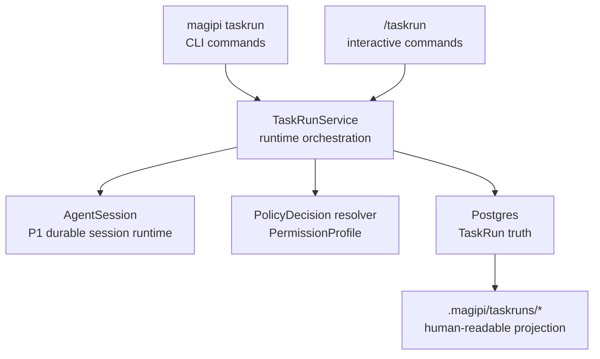

# P2 TaskRun Technical Architecture

## 状态

- Status: accepted
- Date: 2026-05-13
- Roadmap: `design_docs/roadmap/p2_taskrun.md`
- Related decisions:
  - `design_docs/decisions/0007-database-hard-dependency-fail-fast.md`
  - `design_docs/decisions/0008-memory-truth-closure-postgres-with-workspace-projection.md`
  - `design_docs/decisions/0016-provider-side-prompt-cache-contract.md`
  - `design_docs/decisions/0018-package-neomagi-pi-as-monorepo-product-boundary.md`
  - `design_docs/decisions/0021-workspace-materialized-skills-and-env-grants.md`
- Related architecture:
  - `design_docs/architecture/p1_pi_cli_technical_architecture.md`

P2 TaskRun 是 `magipi` 的 workspace-scoped task runtime。它把一个复杂任务从临时聊天计划提升为可恢复、可审计、可有限自动推进的运行实体。

本文件定义 P2 的技术边界。产品目标和用户口径仍以 `design_docs/roadmap/p2_taskrun.md` 为准。

## Source Map

外部引用使用在线 URL，不引用本地跨 repo 路径。

| 主题 | 来源 |
| --- | --- |
| P1 session / policy / compaction 基线 | `design_docs/architecture/p1_pi_cli_technical_architecture.md` |
| pi-autoresearch | <https://github.com/davebcn87/pi-autoresearch> |
| pi-autoresearch changelog | <https://github.com/davebcn87/pi-autoresearch/blob/main/CHANGELOG.md> |
| Claude Code auto mode | <https://www.anthropic.com/engineering/claude-code-auto-mode>, <https://code.claude.com/docs/en/auto-mode-config> |
| Claude Code permission / cleanup incidents | <https://github.com/anthropics/claude-code/issues/22665>, <https://github.com/anthropics/claude-code/issues/36637>, <https://github.com/anthropics/claude-code/issues/14345>, <https://github.com/anthropics/claude-code/issues/46444> |

## Architecture Position

P2 adds one product layer on top of the P1 agent/session runtime:



P2 does not replace `AgentSession`. P2 uses it as the execution engine and adds task-level orchestration, state, permission profiles, step boundaries, and experiment semantics around it.

## Core Decisions

### D1. Postgres Is TaskRun Truth

TaskRun state is not a workspace file truth. P2 follows ADR-0007 and ADR-0008:

- Postgres tables are the machine-written truth.
- Workspace files are projection / export / human readability.
- DB unavailable means `taskrun start`, `taskrun step`, and `taskrun run` fail fast.
- Projection files can be regenerated from DB.
- Manual edits to projection files do not become truth unless a future explicit import / reconcile command is designed.

Minimum logical tables:

```sql
task_runs(
  id uuid primary key,
  workspace_root text not null,
  agent_session_id uuid not null references agent_sessions(id),
  goal text not null,
  status text not null,
  permission_profile jsonb not null,
  budget jsonb not null default '{}'::jsonb,
  stop_conditions jsonb not null default '{}'::jsonb,
  current_step_id uuid null,
  summary jsonb not null default '{}'::jsonb,
  heartbeat_at timestamptz null,
  created_at timestamptz not null,
  updated_at timestamptz not null,
  closed_at timestamptz null
)

task_steps(
  id uuid primary key,
  task_run_id uuid not null references task_runs(id),
  step_index integer not null,
  title text not null,
  status text not null,
  input jsonb not null default '{}'::jsonb,
  output jsonb not null default '{}'::jsonb,
  conclusion text null,
  started_at timestamptz null,
  ended_at timestamptz null,
  unique(task_run_id, step_index)
)

task_events(
  id uuid primary key,
  task_run_id uuid not null references task_runs(id),
  step_id uuid null references task_steps(id),
  event_type text not null,
  payload jsonb not null,
  occurred_at timestamptz not null
)

task_permission_decisions(
  id uuid primary key,
  task_run_id uuid not null references task_runs(id),
  step_id uuid null references task_steps(id),
  tool_execution_id uuid null references agent_tool_executions(id),
  policy_request jsonb not null,
  raw_decision jsonb not null,
  resolved_decision jsonb not null,
  profile_name text not null,
  occurred_at timestamptz not null
)

task_experiments(
  id uuid primary key,
  task_run_id uuid not null references task_runs(id),
  step_id uuid not null references task_steps(id),
  hypothesis text not null,
  change jsonb not null default '{}'::jsonb,
  command jsonb not null default '{}'::jsonb,
  metrics jsonb not null default '{}'::jsonb,
  result jsonb not null default '{}'::jsonb,
  decision text not null,
  diff_ref jsonb not null default '{}'::jsonb,
  created_at timestamptz not null
)
```

Physical schema can start smaller, but M1 must preserve these logical contracts.

`task_events.step_id` may be null only for task-run-level events such as TaskRun start, close, cancellation, or permission profile change. Experiment permission decisions remain in `task_permission_decisions` and are linked by `task_run_id`, `step_id`, and `tool_execution_id`.

`workspace_root` is the creation-time workspace path. If a workspace is moved, P2 does not infer relocation automatically; a future explicit migrate command would be required.

`agent_session_id` points at the durable P1 session used by the TaskRun. An active TaskRun must not outlive or lose that session; closed TaskRuns keep the session for audit and replay.

TaskRun status values:

```text
pending
running
blocked
completed
failed
cancelled
archived
```

Legal TaskRun transitions:

```text
pending -> running
running -> blocked | completed | failed | cancelled
running(stale) -> blocked
blocked -> running | failed | cancelled
completed -> archived
failed -> archived
cancelled -> archived
```

`heartbeat_at` is the stale-running signal for crash recovery. While a TaskRun is `running`, the owning process updates `heartbeat_at`. `taskrun start`, `taskrun status`, and `taskrun resume` must detect stale running TaskRuns in the workspace before enforcing the single-running rule. A stale `running` TaskRun is moved to `blocked` with a task-run-level event; it must not keep the workspace permanently locked.

`taskrun resume <id>` only transitions `blocked -> running`. It may resume a TaskRun that was first moved from stale `running` to `blocked`; it must fail fast for `completed`, `failed`, `cancelled`, and `archived` TaskRuns.

Minimal `budget` contract:

```json
{
  "max_steps": 5,
  "max_consecutive_failures": 2,
  "max_consecutive_denies": 3,
  "max_total_denies": 20,
  "deadline_utc": null
}
```

Minimal `stop_conditions` contract:

```json
{
  "on_completion": "close",
  "on_workspace_dirty": "fail",
  "on_irrecoverable_test_failure": "fail"
}
```

The implementation may add fields later, but M1-M5 code must not invent alternate names for the fields above.

Projection layout:

```text
.magipi/taskruns/<task-run-id>/
  state.json
  events.jsonl
  summary.md
```

These files are generated from DB and must include a notice that manual edits are not truth.

### D2. One TaskRun Uses One Long-Lived AgentSession

Initial P2 contract:

```text
1 TaskRun = 1 long-lived AgentSession
1 step = semantic slice inside that AgentSession
```

TaskRun does not create a new session for every step. A step records a bounded slice of user prompt, assistant events, tool executions, audit events, permission decisions, and conclusion. This lets P2 reuse P1 behavior:

- `/resume`, `/tree`, branch summary, and compaction keep working on the same durable session.
- provider cache affinity from ADR-0016 remains stable for the task.
- session JSONL / structured export can still explain the lower-level agent run.
- `task_steps` adds task semantics without duplicating `agent_session_entries`.

While a TaskRun is active, its `agent_session_id` is task-owned. User session commands such as `/new`, `/resume <other>`, `/fork`, and `/clone` create or select normal user sessions; they do not rebind or replace the TaskRun's session. A TaskRun must be affected through explicit TaskRun commands such as `taskrun resume`, `taskrun cancel`, or `taskrun close`.

Forking a TaskRun is out of P2 core unless an implementation plan explicitly adds it. If needed later, fork should create a new TaskRun pointing to a forked AgentSession and record parent task lineage.

### D3. Step Lifecycle

Each step is explicit and auditable:

```text
pending -> running -> done | failed | blocked | cancelled
```

`task_steps.title` defaults to a deterministic value such as `Step <step_index>`. An LLM-generated title may be stored for display after validation, but lookup, ordering, and resume must use IDs, indexes, and statuses rather than title text.

Step execution flow:

1. Load TaskRun from Postgres.
2. Build deterministic TaskRun rehydration summary from DB fields.
3. Inject the summary as provider-visible task context before the next agent turn.
4. Execute one `AgentSession.prompt(...)` turn or one bounded continuation.
5. Record tool executions, audit events, permission decisions, and task events.
6. Finalize step output and update TaskRun summary.
7. Regenerate workspace projection.

The summary must not depend on the current chat context. A process restart must be able to reconstruct the same step state from Postgres alone.

P1 steering primitives remain available but must preserve step boundaries:

- `steer` during a running step is recorded as an inline `task_events` entry for the current step and does not create a new step.
- `abort` cancels the current step and moves the TaskRun to `blocked`; cancelling the entire TaskRun requires explicit `taskrun cancel`.
- `follow_up` during a bounded auto loop is deferred to the next step boundary and blocks further automatic progression until recorded.

### D4. Rehydration Summary Is Deterministic First

TaskRun summary is a structured state compression, not long-term memory.

Required fields:

```text
goal
status
current_step
completed_steps
blocked_steps
last_attempt
current_best
workspace_state
permission_profile
next_action
```

The host builds these fields deterministically from `task_runs`, `task_steps`, `task_events`, tool execution records, and experiment records. An LLM may add an optional narrative paragraph, but it cannot be the only source of truth and cannot overwrite structured fields without validation.

P1 compaction remains session-level and may still use `session_before_compact` plus persisted `compactionSummary` entries. TaskRun state does not live inside the compaction summary.

At every TaskRun step start, the host builds the deterministic TaskRun summary from DB and injects it into the next `AgentSession.prompt(...)` as provider-visible task context after any P1 `compactionSummary` / `branchSummary` context. Compaction never clears `task_runs`, `task_steps`, `task_events`, `task_permission_decisions`, or `task_experiments`.

P2 should not rely on an LLM compaction summary to preserve metrics, keep/revert decisions, or stop conditions.

### D5. PermissionProfile Resolver Extends PolicyDecision

P2 does not introduce a second permission type system. It extends the existing P1 policy contract:

```python
PolicyDecision.effect = "allow" | "block" | "confirm"
```

P2 adds:

- `PermissionProfile` stored on `task_runs.permission_profile`.
- a non-interactive resolver for `PolicyDecision(effect="confirm")`.
- audit records for raw and resolved decisions.
- profile-scoped path, command, network, git, timeout, and budget rules.

Permission profile definitions live in existing settings, not a new config language. P2 supports exactly three builtin profile names:

```text
interactive
guarded
full
```

Workspace `.magipi/settings.json` and global settings may configure the scope of these builtin profiles under `taskrun.permissionProfiles.<profile>`. P2 does not support arbitrary profile names. `magipi taskrun start --permission <profile>` selects one of the builtin profiles. Resolution order is CLI selection / override, workspace `.magipi/settings.json`, global settings, then builtin `interactive`.

Resolution rules:

| Profile | `allow` | `block` | `confirm` |
| --- | --- | --- | --- |
| `interactive` | execute | block | ask UI adapter |
| `guarded` | execute only inside low-risk scope | block | block or mark blocker; never wait |
| `full` | execute inside explicit scope | block | auto-allow only if scope proves coverage; otherwise block/fail step |

`full` never means host-wide permission. It means "auto-resolve within explicit scope."

At command start, runtime must detect whether an interactive UI adapter is available. In non-TTY / headless execution, `interactive` profile fails fast before tool execution and asks the caller to choose `guarded` or `full`; it must not silently downgrade to another profile.

The resolver must run before tool execution and must write both raw and resolved decisions. In headless / non-interactive mode no path may reach TUI confirmation.

The resolver wraps the existing policy evaluator rather than replacing it:

```python
raw = policy_module.evaluate(request)
resolved = permission_profile_resolver.resolve(raw, task_run.permission_profile)
audit.write(raw_decision=raw, resolved_decision=resolved)
```

Tool execution uses `resolved.effect`; audit and `task_permission_decisions` retain both values.

### D6. Shell, Git, And Cleanup Are Tool-Layer Contracts

Permission safety cannot be prompt-only.

P2 must preserve and harden the existing shell policy:

- shell commands are parsed before execution;
- compound commands, chained commands, subshells, shell wrappers, interpreter `-c` / `-e`, redirects, and output paths are evaluated fail-closed;
- a command is blocked if any segment is outside scope;
- `git commit`, `git commit --amend`, `git reset`, `git checkout`, `git clean`, `git push`, and worktree cleanup are governed by tool-layer policy;
- `git.allow_commit: false` cannot be bypassed by prompt text or helper scripts;
- TaskRun close/cleanup/revert/archive requires a positive work-persisted signal.

P2 does not implement LLM-driven cleanup. Automatic cleanup without a persisted-work proof is forbidden.

TaskRun close / cleanup / revert / archive must not rely on model narration. It must satisfy all base checks and at least one persisted-work check.

Base checks:

- no `task_steps.status = 'running'`;
- all running tool executions are complete, cancelled, or failed;
- task projections have been regenerated from DB or marked stale.

Persisted-work checks, any one is sufficient:

- workspace git state matches the TaskRun start snapshot or a recorded clean revert;
- a user-approved commit, artifact archive, or diff reference is recorded in `task_events`;
- the user explicitly passes an acknowledge-uncommitted option, which is recorded as a task-run-level event.

### D7. Step Queue Is Owned By TaskRun

P2 owns task progression in Postgres. The initial queue model is deliberately linear:

- `task_steps.step_index` defines execution order.
- `task_steps.status` defines whether a step is pending, running, done, failed, blocked, or cancelled.
- `task_runs.current_step_id` identifies the active step.
- `taskrun next` reads the next pending step and deterministic summary from DB.

M1-M4 acceptance is defined by this Postgres-backed linear queue.

P2 permits multiple TaskRuns in one workspace, but only one TaskRun may have `status = 'running'` at a time. Starting or auto-running a second TaskRun in the same workspace must fail fast. Pending, blocked, completed, failed, cancelled, and archived TaskRuns may coexist.

Single-running enforcement always runs after stale-running detection. A crashed process must not leave a permanent `running` lock behind.

Command semantics:

```text
list = current workspace TaskRun records
history <id> = step timeline plus key task_events for one TaskRun
events <id> = complete task_events stream for one TaskRun
next <id> = next pending step plus deterministic TaskRun summary
```

### D8. Experiment Kernel Contract

Experiment / benchmark loop is generic and not the final QMD autoresearch showcase packaging.

Minimum experiment record:

```text
hypothesis
change
command
metric
result
decision
diff
permission_decisions
```

P2 records this as `task_experiments`, a durable child record of `task_steps`. `task_steps.output` may include a display summary, but metric / decision history must not exist only inside opaque step output JSON. Permission decisions are joined through `task_permission_decisions`.

Metric output protocol:

```text
METRIC name=value
```

Parser requirements:

- one metric per line;
- names match a narrow identifier pattern such as `[\w.µ]+`;
- values must parse as finite numbers;
- deny prototype-pollution keys such as `__proto__`, `constructor`, and `prototype`;
- duplicate names use deterministic last-wins semantics or fail closed; the implementation plan must choose one.

Keep/revert contract:

- baseline, trial result, and decision are recorded before mutating workspace state further;
- `keep` requires explicit improvement or accepted tradeoff;
- `revert` must not remove TaskRun DB truth or workspace projection;
- if git is used for rollback, ledger/projection paths must be excluded or regenerated from DB afterward;
- no auto commit unless permission profile and implementation plan explicitly allow it.

### D9. P3 Readiness Is Internal, Not A Frozen Host API

ADR-0018 says memory / gateway interfaces should be extracted from real usage. P2 therefore must not freeze a public Gateway API.

P2 may expose internal service methods that CLI commands use:

```text
start
resume
step
run
cancel
list
status
summary
history
events
set_permission_profile
```

These are implementation seams, not a stable Gateway contract. P3 will define public host APIs after TaskRun behavior is proven through CLI usage and tests.

## Milestone Architecture Mapping

### P2-M0 Architecture Contract

Acceptance:

- this document is reviewed and marked accepted;
- roadmap references this document;
- no implementation starts until TaskRun truth, status transitions, stale-running recovery, budget / stop condition fields, step queue, permission resolver, compaction injection, experiment records, AgentSession ownership, single-running concurrency, headless permission behavior, steer/follow-up/abort behavior, and work-persisted close checks are unambiguous.

### P2-M1 TaskRun Skeleton

Acceptance:

- Postgres task schema is bootstrapped and versioned;
- `magipi taskrun start/status/summary/close` uses DB truth;
- projection files regenerate from DB;
- DB unavailable causes fail-fast;
- resume does not depend on workspace projection files;
- stale `running` TaskRuns are detected and moved to `blocked` before start/status/resume enforces single-running rules.

### P2-M2a Non-Interactive Confirm Resolver

Acceptance:

- existing `PolicyDecision(confirm)` is resolved by `PermissionProfile`;
- `guarded` and `full` modes never wait on TUI confirm;
- raw and resolved decisions are recorded in audit/task tables;
- repeated deny/block exits with an explicit budget reason, not a hang.

### P2-M2b Scope Configuration

Acceptance:

- path, command, network, git, timeout, and budget scopes are config-backed;
- shell compound command tests cover deny bypass cases;
- profile state is stored with TaskRun and visible in summary.

### P2-M3 Manual Step Execution

Acceptance:

- `magipi taskrun step` records exactly one bounded step;
- step can fail/block without corrupting TaskRun state;
- next step can rehydrate from DB summary.

### P2-M4 Step Queue And Status Views

Acceptance:

- `magipi taskrun list`, `history`, and `next` read from Postgres truth;
- pending/running/done/failed/blocked/cancelled transitions are visible;
- the next step query is deterministic for linear TaskRuns;
- `list`, `history`, and `next` read only TaskRun DB records and generated summary fields.

### P2-M5 Bounded Auto Loop

Acceptance:

- `magipi taskrun run --max-steps N` cannot run indefinitely;
- stop conditions include max steps, completion, consecutive failures, consecutive denies, total denies, budget exhaustion, dirty workspace anomaly, irrecoverable test failure, cancellation, and permission block;
- no non-interactive path waits for user input.

### P2-M6 Experiment / Benchmark Kernel

Acceptance:

- baseline/trial/metric/decision/diff records are durable;
- deterministic summary preserves current best, last attempt, and next action;
- keep/revert is explainable and policy-governed;
- ledger survives revert/cleanup.

### P2-M7 P3 Readiness

Acceptance:

- CLI implementation seams are stable enough to extract later;
- no public Gateway API is frozen in P2;
- P3 can start from observed CLI TaskRun behavior and event records.

## Explicit Non-Goals

- P2 does not implement Gateway channels, HTTP/WebSocket APIs, or notifications.
- P2 does not implement a full long-term memory system.
- TaskRun does not write long-term memory as a side effect; memory writes still require a DB-backed memory tool and approval path.
- Workspace TaskRun files are not truth.
- P2 does not rely on LLM-driven cleanup, prompt-only permission, or implicit auto-commit.
- P2 does not package the final QMD autoresearch showcase README/report until the P2 phase-end showcase pass.

## Implementation Readiness

P2 implementation plans can start when:

- this architecture is accepted;
- `design_docs/roadmap/p2_taskrun.md` no longer says workspace files are TaskRun truth;
- the first implementation plan scopes M1 and M2a narrowly;
- auto loop and experiment kernel are treated as later slices rather than prerequisites for TaskRun skeleton.
