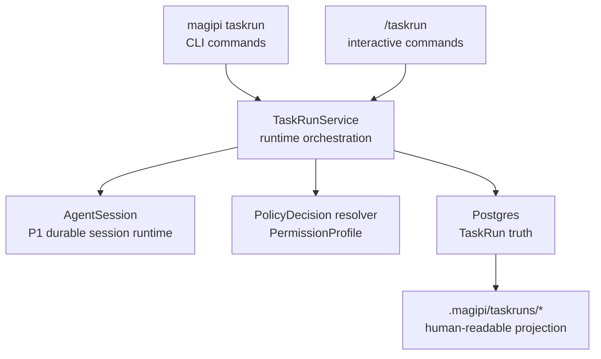

# P2 TaskRun Technical Architecture

## 状态

- Status: accepted
- Date: 2026-05-13
- Roadmap: `design_docs/roadmap/p2_taskrun.md`
- Related decisions:
  - `design_docs/decisions/0007-database-hard-dependency-fail-fast.md`
  - `design_docs/decisions/0008-memory-truth-closure-postgres-with-workspace-projection.md`
  - `design_docs/decisions/0016-provider-side-prompt-cache-contract.md`
  - `design_docs/decisions/0018-package-neomagi-pi-as-monorepo-product-boundary.md`
  - `design_docs/decisions/0021-workspace-materialized-skills-and-env-grants.md`
- Related architecture:
  - `design_docs/architecture/p1_pi_cli_technical_architecture.md`

P2 TaskRun 是 `magipi` 的 workspace-scoped task runtime。它把一个复杂任务从临时聊天计划提升为可恢复、可审计、可有限自动推进的运行实体。

本文件定义 P2 的技术边界。产品目标和用户口径仍以 `design_docs/roadmap/p2_taskrun.md` 为准。

## Source Map

外部引用使用在线 URL，不引用本地跨 repo 路径。

| 主题 | 来源 |
| --- | --- |
| P1 session / policy / compaction 基线 | `design_docs/architecture/p1_pi_cli_technical_architecture.md` |
| pi-autoresearch | <https://github.com/davebcn87/pi-autoresearch> |
| pi-autoresearch changelog | <https://github.com/davebcn87/pi-autoresearch/blob/main/CHANGELOG.md> |
| Claude Code auto mode | <https://www.anthropic.com/engineering/claude-code-auto-mode>, <https://code.claude.com/docs/en/auto-mode-config> |
| Claude Code permission / cleanup incidents | <https://github.com/anthropics/claude-code/issues/22665>, <https://github.com/anthropics/claude-code/issues/36637>, <https://github.com/anthropics/claude-code/issues/14345>, <https://github.com/anthropics/claude-code/issues/46444> |

## Architecture Position

P2 adds one product layer on top of the P1 agent/session runtime:



P2 does not replace `AgentSession`. P2 uses it as the execution engine and adds task-level orchestration, state, permission profiles, step boundaries, and experiment semantics around it.

## Core Decisions

### D1. Postgres Is TaskRun Truth

TaskRun state is not a workspace file truth. P2 follows ADR-0007 and ADR-0008:

- Postgres tables are the machine-written truth.
- Workspace files are projection / export / human readability.
- DB unavailable means `taskrun start`, `taskrun step`, and `taskrun run` fail fast.
- Projection files can be regenerated from DB.
- Manual edits to projection files do not become truth unless a future explicit import / reconcile command is designed.

Minimum logical tables:

```sql
task_runs(
  id uuid primary key,
  workspace_root text not null,
  agent_session_id uuid not null references agent_sessions(id),
  goal text not null,
  status text not null,
  permission_profile jsonb not null,
  budget jsonb not null default '{}'::jsonb,
  stop_conditions jsonb not null default '{}'::jsonb,
  current_step_id uuid null,
  summary jsonb not null default '{}'::jsonb,
  heartbeat_at timestamptz null,
  created_at timestamptz not null,
  updated_at timestamptz not null,
  closed_at timestamptz null
)

task_steps(
  id uuid primary key,
  task_run_id uuid not null references task_runs(id),
  step_index integer not null,
  title text not null,
  status text not null,
  input jsonb not null default '{}'::jsonb,
  output jsonb not null default '{}'::jsonb,
  conclusion text null,
  started_at timestamptz null,
  ended_at timestamptz null,
  unique(task_run_id, step_index)
)

task_events(
  id uuid primary key,
  task_run_id uuid not null references task_runs(id),
  step_id uuid null references task_steps(id),
  event_type text not null,
  payload jsonb not null,
  occurred_at timestamptz not null
)

task_permission_decisions(
  id uuid primary key,
  task_run_id uuid not null references task_runs(id),
  step_id uuid null references task_steps(id),
  tool_execution_id uuid null references agent_tool_executions(id),
  policy_request jsonb not null,
  raw_decision jsonb not null,
  resolved_decision jsonb not null,
  profile_name text not null,
  occurred_at timestamptz not null
)

task_experiments(
  id uuid primary key,
  task_run_id uuid not null references task_runs(id),
  step_id uuid not null references task_steps(id),
  hypothesis text not null,
  change jsonb not null default '{}'::jsonb,
  command jsonb not null default '{}'::jsonb,
  metrics jsonb not null default '{}'::jsonb,
  result jsonb not null default '{}'::jsonb,
  decision text not null,
  diff_ref jsonb not null default '{}'::jsonb,
  created_at timestamptz not null
)
```

Physical schema can start smaller, but M1 must preserve these logical contracts.

`task_events.step_id` may be null only for task-run-level events such as TaskRun start, close, cancellation, or permission profile change. Experiment permission decisions remain in `task_permission_decisions` and are linked by `task_run_id`, `step_id`, and `tool_execution_id`.

`workspace_root` is the creation-time workspace path. If a workspace is moved, P2 does not infer relocation automatically; a future explicit migrate command would be required.

`agent_session_id` points at the durable P1 session used by the TaskRun. An active TaskRun must not outlive or lose that session; closed TaskRuns keep the session for audit and replay.

TaskRun status values:

```text
pending
running
blocked
completed
failed
cancelled
archived
```

Legal TaskRun transitions:

```text
pending -> running | cancelled
running -> pending | blocked | completed | failed | cancelled
running(stale) -> blocked
blocked -> running | failed | cancelled
completed -> archived
failed -> archived
cancelled -> archived
```

`pending -> cancelled` covers explicit close/cancel before the first TaskRun step starts. `running -> pending` covers a successful manual step that leaves the TaskRun open for the next explicit step. `completed` is reserved for a TaskRun that has actually executed to completion.

`heartbeat_at` is the stale-running signal for crash recovery. While a TaskRun is `running`, the owning process updates `heartbeat_at`. `taskrun start`, `taskrun status`, `taskrun step`, and `taskrun resume` must detect stale running TaskRuns in the workspace before enforcing the single-running rule. A stale `running` TaskRun is moved to `blocked` with a task-run-level event; it must not keep the workspace permanently locked.

`taskrun resume <id>` only transitions `blocked -> running`. It may resume a TaskRun that was first moved from stale `running` to `blocked`; it must fail fast for `completed`, `failed`, `cancelled`, and `archived` TaskRuns.

Minimal `budget` contract:

```json
{
  "max_steps": 5,
  "max_consecutive_failures": 2,
  "max_consecutive_denies": 3,
  "max_total_denies": 20,
  "deadline_utc": null
}
```

Minimal `stop_conditions` contract:

```json
{
  "on_completion": "close",
  "on_workspace_dirty": "fail",
  "on_irrecoverable_test_failure": "fail"
}
```

The implementation may add fields later, but M1-M5 code must not invent alternate names for the fields above.

Projection layout:

```text
.magipi/taskruns/<task-run-id>/
  state.json
  events.jsonl
  summary.md
```

These files are generated from DB. `state.json` and `summary.md` must include a notice that manual edits are not truth. `events.jsonl` is a pure `task_events` stream so line-stream consumers do not need to skip non-event rows.

Normal `taskrun status` reads Postgres and reports the current projection path without writing a projection rebuild event. Mutating commands and `taskrun summary` regenerate projection files. Stale-running recovery remains a state repair and records an event even when triggered by status.

### D2. One TaskRun Uses One Long-Lived AgentSession

Initial P2 contract:

```text
1 TaskRun = 1 long-lived AgentSession
1 step = semantic slice inside that AgentSession
```

TaskRun does not create a new session for every step. A step records a bounded slice of user prompt, assistant events, tool executions, audit events, permission decisions, and conclusion. This lets P2 reuse P1 behavior:

- `/resume`, `/tree`, branch summary, and compaction keep working on the same durable session.
- provider cache affinity from ADR-0016 remains stable for the task.
- session JSONL / structured export can still explain the lower-level agent run.
- `task_steps` adds task semantics without duplicating `agent_session_entries`.

While a TaskRun is active, its `agent_session_id` is task-owned. User session commands such as `/new`, `/resume <other>`, `/fork`, and `/clone` create or select normal user sessions; they do not rebind or replace the TaskRun's session. A TaskRun must be affected through explicit TaskRun commands such as `taskrun resume`, `taskrun cancel`, or `taskrun close`.

TaskRun ownership is permanent. A terminal TaskRun keeps its AgentSession hidden from normal session commands; replay, export, or audit access must go through explicit TaskRun-aware paths.

Forking a TaskRun is out of P2 core unless an implementation plan explicitly adds it. If needed later, fork should create a new TaskRun pointing to a forked AgentSession and record parent task lineage.

### D3. Step Lifecycle

Each step is explicit and auditable:

```text
pending -> running -> done | failed | blocked | cancelled
```

`task_steps.title` defaults to a deterministic value such as `Step <step_index>`. An LLM-generated title may be stored for display after validation, but lookup, ordering, and resume must use IDs, indexes, and statuses rather than title text.

Step execution flow:

1. Load TaskRun from Postgres.
2. Build deterministic TaskRun rehydration summary from DB fields.
3. Inject the summary as provider-visible task context before the next agent turn.
4. Execute one `AgentSession.prompt(...)` turn or one bounded continuation.
5. Record tool executions, audit events, permission decisions, and task events.
6. Finalize step output and update TaskRun summary.
7. Regenerate workspace projection.

The summary must not depend on the current chat context. A process restart must be able to reconstruct the same step state from Postgres alone.

P1 steering primitives remain available but must preserve step boundaries:

- `steer` during a running step is recorded as an inline `task_events` entry for the current step and does not create a new step.
- `abort` cancels the current step and moves the TaskRun to `blocked`; cancelling the entire TaskRun requires explicit `taskrun cancel`.
- `follow_up` during a bounded auto loop is deferred to the next step boundary and blocks further automatic progression until recorded.

### D4. Rehydration Summary Is Deterministic First

TaskRun summary is a structured state compression, not long-term memory.

Required fields:

```text
goal
status
current_step
completed_steps
blocked_steps
last_attempt
current_best
workspace_state
permission_profile
next_action
```

The host builds these fields deterministically from `task_runs`, `task_steps`, `task_events`, tool execution records, and experiment records. An LLM may add an optional narrative paragraph, but it cannot be the only source of truth and cannot overwrite structured fields without validation.

P1 compaction remains session-level and may still use `session_before_compact` plus persisted `compactionSummary` entries. TaskRun state does not live inside the compaction summary.

At every TaskRun step start, the host builds the deterministic TaskRun summary from DB and injects it into the next `AgentSession.prompt(...)` as provider-visible task context after any P1 `compactionSummary` / `branchSummary` context. Compaction never clears `task_runs`, `task_steps`, `task_events`, `task_permission_decisions`, or `task_experiments`.

P2 should not rely on an LLM compaction summary to preserve metrics, keep/revert decisions, or stop conditions.

### D5. PermissionProfile Resolver Extends PolicyDecision

P2 does not introduce a second permission type system. It extends the existing P1 policy contract:

```python
PolicyDecision.effect = "allow" | "block" | "confirm"
```

P2 adds:

- `PermissionProfile` stored on `task_runs.permission_profile`.
- a non-interactive resolver for `PolicyDecision(effect="confirm")`.
- audit records for raw and resolved decisions.
- profile-scoped path, command, network, git, timeout, and budget rules.

Permission profile definitions live in existing settings, not a new config language. P2 supports exactly three builtin profile names:

```text
interactive
guarded
full
```

Workspace `.magipi/settings.json` and global settings may configure the scope of these builtin profiles under `taskrun.permissionProfiles.<profile>`. P2 does not support arbitrary profile names. `magipi taskrun start --permission <profile>` selects one of the builtin profiles. Resolution order is CLI selection / override, workspace `.magipi/settings.json`, global settings, then builtin `interactive`.

Resolution rules:

| Profile | `allow` | `block` | `confirm` |
| --- | --- | --- | --- |
| `interactive` | execute | block | ask UI adapter |
| `guarded` | execute only inside low-risk scope | block | block or mark blocker; never wait |
| `full` | execute inside explicit scope | block | auto-allow only if scope proves coverage; otherwise block/fail step |

`full` never means host-wide permission. It means "auto-resolve within explicit scope."

At command start, runtime must detect whether an interactive UI adapter is available. In non-TTY / headless execution, `interactive` profile fails fast before tool execution and asks the caller to choose `guarded` or `full`; it must not silently downgrade to another profile.

The resolver must run before tool execution and must write both raw and resolved decisions. In headless / non-interactive mode no path may reach TUI confirmation.

The resolver wraps the existing policy evaluator rather than replacing it:

```python
raw = policy_module.evaluate(request)
resolved = permission_profile_resolver.resolve(raw, task_run.permission_profile)
audit.write(raw_decision=raw, resolved_decision=resolved)
```

Tool execution uses `resolved.effect`; audit and `task_permission_decisions` retain both values.

### D6. Shell, Git, And Cleanup Are Tool-Layer Contracts

Permission safety cannot be prompt-only.

P2 must preserve and harden the existing shell policy:

- shell commands are parsed before execution;
- compound commands, chained commands, subshells, shell wrappers, interpreter `-c` / `-e`, redirects, and output paths are evaluated fail-closed;
- a command is blocked if any segment is outside scope;
- `git commit`, `git commit --amend`, `git reset`, `git checkout`, `git clean`, `git push`, and worktree cleanup are governed by tool-layer policy;
- `git.allow_commit: false` cannot be bypassed by prompt text or helper scripts;
- TaskRun close/cleanup/revert/archive requires a positive work-persisted signal.

P2 does not implement LLM-driven cleanup. Automatic cleanup without a persisted-work proof is forbidden.

TaskRun close / cleanup / revert / archive must not rely on model narration. It must satisfy all base checks and at least one persisted-work check.

Base checks:

- no `task_steps.status = 'running'`;
- all running tool executions are complete, cancelled, or failed;
- task projections have been regenerated from DB or marked stale.

Persisted-work checks, any one is sufficient:

- workspace git state matches the TaskRun start snapshot or a recorded clean revert;
- a user-confirmed commit, artifact archive, or diff reference is recorded in `task_events`;
- the user explicitly passes an acknowledge-uncommitted option, which is recorded as a task-run-level event.

### D7. Step Queue Is Owned By TaskRun

P2 owns task progression in Postgres. The initial queue model is deliberately linear:

- `task_steps.step_index` defines execution order.
- `task_steps.status` defines whether a step is pending, running, done, failed, blocked, or cancelled.
- `task_runs.current_step_id` identifies the active step.
- `taskrun next` reads the next pending step and deterministic summary from DB.

M1-M4 acceptance is defined by this Postgres-backed linear queue.

P2 permits multiple TaskRuns in one workspace, but only one TaskRun may have `status = 'running'` at a time. Starting or auto-running a second TaskRun in the same workspace must fail fast. Pending, blocked, completed, failed, cancelled, and archived TaskRuns may coexist.

Single-running enforcement always runs after stale-running detection. A crashed process must not leave a permanent `running` lock behind.

Command semantics:

```text
list = current workspace TaskRun records
history <id> = step timeline plus key task_events for one TaskRun
events <id> = complete task_events stream for one TaskRun
next <id> = next pending step plus deterministic TaskRun summary
```

### D8. Experiment Kernel Contract

Experiment / benchmark loop is generic and not the final QMD autoresearch showcase packaging.

Minimum experiment record:

```text
hypothesis
change
command
metric
result
decision
diff
permission_decisions
```

P2 records this as `task_experiments`, a durable child record of `task_steps`. `task_steps.output` may include a display summary, but metric / decision history must not exist only inside opaque step output JSON. Permission decisions are joined through `task_permission_decisions`.

Metric output protocol:

```text
METRIC name=value
```

Parser requirements:

- one metric per line;
- names match a narrow identifier pattern such as `[\w.µ]+`;
- values must parse as finite numbers;
- deny prototype-pollution keys such as `__proto__`, `constructor`, and `prototype`;
- duplicate names use deterministic last-wins semantics or fail closed; the implementation plan must choose one.

Keep/revert contract:

- baseline, trial result, and decision are recorded before mutating workspace state further;
- `keep` requires explicit improvement or accepted tradeoff;
- `revert` must not remove TaskRun DB truth or workspace projection;
- if git is used for rollback, ledger/projection paths must be excluded or regenerated from DB afterward;
- no auto commit unless permission profile and implementation plan explicitly allow it.

### D9. P3 Readiness Is Internal, Not A Frozen Host API

ADR-0018 says memory / gateway interfaces should be extracted from real usage. P2 therefore must not freeze a public Gateway API.

P2 may expose internal service methods that CLI commands use:

```text
start
resume
step
run
cancel
list
status
summary
history
events
set_permission_profile
```

These are implementation seams, not a stable Gateway contract. P3 will define public host APIs after TaskRun behavior is proven through CLI usage and tests.

## Amendments (accepted 2026-05-17)

These amendments extend D1-D9 with white-box runtime contracts; they were jointly accepted with `design_docs/roadmap/p2_taskrun_whitebox_runtime_supplement.md` and ADR-0023 on 2026-05-17. Subsequent edits to D10-D15 follow the same governance as D1-D9.

### D10. TaskRun Semantic Event Taxonomy
Decision: define the **additions** to `task_events.event_type` for TaskRun-owned white-box semantic events. Raw `AgentEvent` and session-level frames are NOT written directly to `task_events`; they remain in session jsonl, audit tables, and `agent_tool_executions`.

**Two-tier model (binding for the amendment)**:

```text
Tier 1 — task_events truth (every event written here, no exception):
  all existing task_run_* / task_step_* / task_experiment_* events
  + all new white-box semantic events listed below

Tier 2 — KEY_HISTORY_EVENT_TYPES (curated subset for `taskrun history` view):
  step-summary signals enter Tier 2
  high-frequency tool-level / runtime-level events default to Tier 1 only,
    not Tier 2 (avoids polluting history view with one row per tool call)
```

Rationale: `taskrun history` is summary-grade. Promoting `task_tool_observed` (one row per tool call; a step with 50 bash calls would emit 50 rows) into Tier 2 would defeat R2's "no log noise" requirement. Full trace remains queryable via `taskrun events <id>` from Tier 1.

**Existing Tier 2 closed set (NOT renamed, NOT extended for non-summary events)**:

```text
task_run_started / task_run_blocked_stale / task_run_closed /
task_run_permission_profile_updated /
task_run_auto_run_started / task_run_auto_run_iteration_finished /
task_run_auto_run_stopped / task_run_auto_run_cancelled
task_step_started / task_step_completed / task_step_failed /
task_step_blocked / task_step_cancelled
task_experiment_baseline_recorded / task_experiment_trial_recorded /
task_experiment_decided / task_experiment_reverted /
task_experiment_blocked
```

**Additions**:

```text
Step-summary scope — Tier 1 truth + Tier 2 KEY_HISTORY:
  task_step_evidence_recorded         explicit success evidence
  task_step_evidence_missing          claim has no supporting evidence
  task_step_blocker_detected          explicit blocker reason
  task_step_outcome_supported         final claim has matching evidence
  task_step_outcome_unsupported       final claim lacks matching evidence
  task_step_resume_context_generated  rehydration summary regenerated

Tool-detail scope — Tier 1 truth only (NOT in KEY_HISTORY):
  task_tool_observed                  derived from tool_execution_end
  task_tool_policy_resolved           derived from before_tool_call resolver
  task_tool_policy_blocked            denied path

TaskRun-runtime scope — Tier 1 truth only (NOT in KEY_HISTORY; produced only after D14):
  task_runtime_compaction_observed    derived from session compaction
  task_runtime_auto_retry_observed    derived from session auto-retry
```

**Promotion rule**: a tool-detail event MAY be reduced to a step-summary event by step finalize, and that derived summary event enters Tier 2. Example: a `task_tool_observed` with `is_error=true` for a test runner is reduced to `task_step_evidence_missing` (Tier 2); the original `task_tool_observed` stays in Tier 1. No tool-detail or runtime event is itself added to KEY_HISTORY.

**Versioning**: per-event-type `payload_version`, not a single global `schema_version`. Event families evolve independently; migration is per `event_type`.

**Linking**: every derived event carries one or more of `run_id`, `tool_call_id`, `tool_execution_id`, `session_entry_id` pointing to underlying truth.

**Backward compatibility**: existing `task_step_started/completed/failed/blocked/cancelled` are NOT replaced; D12 lifecycle judgments continue to set these. New `task_step_evidence_*` / `task_step_outcome_*` are **complementary signals** written by step finalize alongside the lifecycle status.

**Out of scope for D10**: token-delta / reasoning-stream / message-update events. These remain in session truth, not TaskRun truth.

### D11. Policy Hook Ordering and Resolver Migration
Decision: precise ordering of policy resolution relative to `agent_core` tool execution lifecycle, plus wrapper-to-hook migration plan.

Current state (verified 2026-05-17):

- `packages/magipi/src/agent_core/tool_executor.py:101, 131` emit `tool_execution_start` BEFORE `prepare_tool_call()` runs `before_tool_call`. Policy decision currently cannot precede `tool_execution_start` without core changes.
- `packages/magipi/src/cli/tools/wrapper.py:142` runs `_resolve_policy_decision` inside the wrapper; `:165` `_finalize_governed_execution` writes both `task_permission_decisions` and audit in a `finally` block.

**Decision**: option C — keep the current `agent_core` event order (`tool_execution_start` fires before `before_tool_call` runs). R6 is redefined as "policy resolved before tool body `execute()`", not "before `tool_execution_start`". No `agent_core` core change.

**Binding design principle (P2)**: `agent_core` stays strict pi-mono protocol parity. Formalized in ADR-0023; see `design_docs/decisions/0023-agent-core-pi-mono-protocol-parity.md` for full rationale, governance, and impact on D11/D13/D14/D15. Operational consequence for D11: policy observability is provided at the TaskRun layer through D10 derived events (`task_tool_policy_resolved` / `task_tool_policy_blocked`), correlated to raw `tool_execution_start` / `tool_execution_end` via `tool_call_id`. Consumers needing "tool actually ran" semantics correlate the derived events with `tool_execution_end.isError`.

Selected because: option A breaks shipped event semantics in `agent_core` (downstream consumers expect current order); option B forks pi-mono protocol (NeoMAGI agent_core would diverge from pi-mono, breaking the alignment principle and creating long-term maintenance debt). Option C accepts the constraint that `tool_execution_start` alone is not a "tool will actually run" signal — consumers must correlate.

Considered alternatives (rejected):

```text
A. Reorder agent_core: move tool_execution_start emission AFTER before_tool_call
   resolves. Rejected: changes shipped event semantic; breaks pi-mono parity.

B. Add a new pre-event in agent_core: tool_call_proposed (emitted at start of
   prepare_tool_call, before before_tool_call). Rejected: forks pi-mono
   protocol; conflicts with the P2 design principle that agent_core stays
   strictly aligned with pi-mono.
```

Wrapper migration (regardless of ordering choice):

- Wrapper stops calling `_resolve_policy_decision`. Resolver moves to the `before_tool_call` hook supplied by `TaskRunAgentSession` (D13).
- Wrapper still finalizes audit, but takes `raw_decision` / `resolved_decision` from runtime instead of computing them.
- Wrapper does not write `task_permission_decisions`. The hook does, before the tool body runs.
- Hook block path emits `task_tool_policy_blocked` synchronously (D10 naming). `_StepEventCollector` stops reading `result.details.policyDecision`; it reads derived `task_tool_policy_blocked` events instead.

**Mechanism: PolicyResolutionStore** (hook → wrapper data flow):

```python
# Per-TaskRun-step lifetime; lives on ToolRuntime (or equivalent context).
class PolicyResolutionStore:
    def put(tool_call_id: str, raw: PolicyDecision,
            resolved: PolicyDecision, profile: dict) -> None: ...
    def consume(tool_call_id: str) -> ResolvedPolicy | None: ...
        # Read-and-remove. None means hook did not pre-resolve for this call.
```

Flow:

```text
1. before_tool_call hook (TaskRun mode):
     raw      = policy.evaluate(request)
     resolved = profile_resolver.resolve(raw, task_run.permission_profile)
     task_permission_decisions.append(raw, resolved)
     audit.write_partial(raw, resolved)         # pre-execution audit row
     runtime.policy_resolution_store.put(tool_call_id, raw, resolved, profile)
     if resolved.effect == "block":
         task_events.append(task_tool_policy_blocked, ...)
         return {block: True, reason: ...}
     task_events.append(task_tool_policy_resolved, ...)  # allow path
     return None                                # allow execution

2. wrapper._resolve_policy_decision (cli/tools/wrapper.py:142 entry):
     pre = runtime.policy_resolution_store.consume(tool_call_id)
     if pre is not None:
         return pre                             # hook pre-resolved; skip wrapper resolver
     return _legacy_resolve(request)            # non-TaskRun mode or legacy call site

3. wrapper._finalize_governed_execution (cli/tools/wrapper.py:165 finally):
     if pre was consumed by step 2:
         audit.finalize(pre.raw, pre.resolved, tool_result)
         # task_permission_decisions NOT re-written (hook already wrote)
     else:
         audit.finalize(raw, resolved, tool_result)
         task_permission_decisions.append(raw, resolved)   # legacy path
```

**Hook ↔ `tool_execution_start` ordering** (interaction with D13 listener queue):

D13's listener queue means `tool_execution_start` may not have been processed into an `agent_tool_executions` row by the time the `before_tool_call` hook fires. The current recorder (`packages/magipi/src/cli/core/taskrun_runner.py:181`) looks up `tool_execution_id` by `tool_call_id` and raises if not found — under D13 this would race-fail every step. To avoid this without adding a synchronous barrier in `agent_core` (forbidden by ADR-0023):

- Hook writes `task_permission_decisions` keyed by `tool_call_id` and `task_run_id`; `tool_execution_id` is left NULL (the column already allows NULL per § D1).
- The listener queue consumer, when processing `tool_execution_start` and creating the corresponding `agent_tool_executions` row, back-fills pending `task_permission_decisions` rows matching `tool_call_id` where `tool_execution_id IS NULL`.
- This preserves ADR-0023 (no synchronous barrier added to `agent_core`) and keeps `tool_call_id` as the primary correlation key.
- Step finalize MUST verify all `task_permission_decisions` for the step are back-filled (no `tool_execution_id IS NULL` rows remain) before lifecycle status converges; failure fails the step closed.

Backwards compatibility: existing call sites that pass `taskrun_permission_context` to the wrapper without a `before_tool_call` hook continue to work — `policy_resolution_store.consume` returns `None` and the wrapper falls back to its current resolver. Migration is per call site, not global. P2-M7 acceptance requires TaskRun call sites to use the hook path; non-TaskRun (e.g., interactive mode) call sites may continue on the legacy path until separately migrated.

### D12. Evidence Ledger and Verification State
Decision: where TaskRun stores its claim-vs-evidence consistency signal and how it interacts with `task_steps.status`.

Position:

- `task_steps.status` is NOT extended. Existing lifecycle values (`pending / running / done / failed / blocked / cancelled`) remain authoritative.
- New field `task_steps.output.verification_state` carries the quality signal:

```text
supported           claim has matching tool_observed / evidence_recorded
missing_evidence    claim has no supporting evidence
inconsistent        claim contradicts observed events
abandoned           last assistant turn ended in tool-call stop without completion
error               terminal assistant error
```

- Consistency is computed at step finalize (runner side), not at query time.
- `verification_state ∈ {missing_evidence, inconsistent, abandoned}` MUST drive `task_steps.status` to `blocked` or `failed`. Lifecycle status remains the source of truth for "is this step done"; `verification_state` answers "why".
- Status views display both fields together; no inferences are re-computed on read.

Out of scope for D12: subjective quality metrics (e.g., "code quality score"). Only structural claim-vs-evidence consistency.

### D13. TaskRunAgentSession Adapter Lifecycle
Decision: introduce a TaskRun-owned adapter that holds the white-box runtime, replacing the current direct `Agent` ownership in `cli/core/taskrun_runner.py`.

Shape:

```text
TaskRunAgentSession holds:
  agent: Agent                              in-process agent
  event_queue: asyncio.Queue                listener enqueues; consumer dequeues
  event_consumer: asyncio.Task              processes events sequentially
  abort_signal: asyncio.Event               propagates to agent.abort()
  event_translator: SemanticEventTranslator raw AgentEvent → TaskRun semantic events
  collector: StepEventCollector             consumes semantic events
  session_writer: DurableSessionEventWriter session jsonl
  heartbeat: HeartbeatUpdater               updates task_runs.heartbeat_at
```

Lifecycle:

- Cancel: `agent.abort()` + emit `step_cancelled` or `step_blocked` semantic event; consumer drains queue.
- Resume: a new `TaskRunAgentSession` is constructed for the next step from Postgres summary + durable `AgentSession`. **In-memory agent state is NOT restored across step boundaries**; each step gets a fresh agent loaded with rehydrated context.
- Listener consumer pattern: `subscribe` handler only enqueues; the consumer awaits events sequentially. Handler-internal `await` cannot cause event reorder.

Boundary:

- `AgentSession` (P1) continues to own session truth, compaction, cache affinity.
- `TaskRunAgentSession` owns TaskRun step lifecycle, semantic event translation, evidence ledger, policy hook injection.
- `TaskRunService` does NOT hold `Agent` directly. It holds zero or one `TaskRunAgentSession` per active TaskRun.
- Future P3 Gateway consumes TaskRun projection (read model). It does NOT consume `TaskRunAgentSession` events directly.

### D14. Compaction / Auto-Retry Production in Headless Path
Decision: how `compaction_*` and `auto_retry_*` events become observable in the TaskRun headless runner. Currently they are produced only via `cli/interactive/compaction_runtime.py:77` `CompactionRuntimeMixin`, which `cli/core/taskrun_runner.py` does not use.

Options:

```text
A. Push compaction / auto-retry event emission down into agent_core so all
   consumers (interactive + headless) produce them natively. Cleanest, but
   requires agent_core to know about compaction at all (it currently does not).

B. Define a HeadlessCompactionAdapter mirroring CompactionRuntimeMixin and
   require TaskRunAgentSession (D13) to install it.

C. Refactor CompactionRuntimeMixin so its event-emitting core is reusable
   independent of interactive context; TaskRunAgentSession then wires the
   same core.
```

**Decision**: option C — refactor `CompactionRuntimeMixin` so its event-emitting core is reusable independent of interactive context; `TaskRunAgentSession` wires the same core. Selected because option A elevates compaction from a session-runtime concern to an agent-core concern (too broad), and option B duplicates code paths.

Until D14 is accepted: the supplement's R2 list keeps `compaction_*` / `auto_retry_*` as expectations; TaskRun M7 verification does NOT require these events to appear pre-accept. Once D14 is accepted, real-time visibility of these events in the headless TaskRun path becomes part of M7 acceptance (see § P2-M7).

### D15. Tool Execution Progress Event Timing
Decision: `agent_core` must emit `tool_execution_update` events **during** tool body execution, not buffered until the tool returns.

Current state (verified 2026-05-17):

- `packages/magipi/src/agent_core/tool_executor.py:275-299` defines `on_update` as a sync callback that only appends `partial_result` to a local list.
- `tool_executor.py:170-191` and `:194-226` emit buffered `tool_execution_update` events AFTER `tool.execute(...)` returns; no events fire during tool body execution.
- pi-mono equivalent (`packages/agent/src/agent-loop.ts:558-575`) emits inline within the `onUpdate` callback, so subscribers see partial results in real-time as the tool runs.

Required behavior:

- A long-running tool (e.g., 5-minute `bash` / `pytest` / benchmark) must produce `tool_execution_update` events observable by subscribers **during** execution, not retroactively after the tool returns.
- The fix lives in `agent_core/tool_executor.py`; downstream consumers (`_StepEventCollector`, the proposed `task_runtime_*` events under D10) inherit real-time visibility once the producer is fixed.

Implementation options (subject to plan-level decision):

```text
A. on_update bridge schedules asyncio.create_task(emit(...)) inside the
   sync callback. Tool code stays sync. Risk: unhandled task exceptions,
   loss of ordering guarantee between concurrent tool calls.

B. Change on_update signature to async/Awaitable; tool code awaits emit
   directly. Risk: existing sync tool implementations break; signature
   change is intrusive across all tools.

C. Insert an asyncio.Queue between tool and emitter. Producer (sync
   on_update callback) puts partial results; a dedicated consumer task
   drains the queue and emits in FIFO order. Preserves sync tool API,
   guarantees ordering, and shares its consumer-task pattern with the
   listener queue proposed in D13.
```

**Decision**: option C — insert an `asyncio.Queue` between tool and emitter; the sync `on_update` callback puts partial results onto the queue, a dedicated consumer task drains and emits in FIFO order. Selected because option A loses ordering guarantees when concurrent tool calls race their `create_task` schedules, and option B requires breaking the existing sync `on_update` callback API across every tool implementation. The chosen mechanism reuses the same `asyncio.Queue` + consumer-task pattern proposed in D13 for the listener side.

**Yielding requirement**: the `asyncio.Queue` only delivers real-time emission when the tool body itself yields control to the event loop (via `await` or by running blocking work in an executor). A CPU-bound synchronous tool that never yields will block the event loop, the consumer task cannot drain mid-execution, and updates will batch back to exactly the post-return behavior D15 is fixing.

Long-running tool implementations MUST EITHER:

- be `async` and explicitly yield between progress updates (e.g., `await asyncio.sleep(0)` after `on_update(...)`, or perform `await`-ing I/O); OR
- offload the blocking work via `asyncio.to_thread(...)` / `loop.run_in_executor(...)`, keeping the event loop free to drain the consumer queue.

M7 acceptance test covers the happy path: a long-running async tool (≥3 seconds) with periodic `on_update` calls; subscriber receives `tool_execution_update` events before the tool returns its final result. A negative test SHOULD assert that a deliberately-blocking sync tool fails the same assertion, documenting that yielding is the tool's responsibility (the queue's promise is ordering and decoupling, not magic real-time delivery from a blocked loop).

Scope note: this is an `agent_core` correctness item, not a TaskRun-layer amendment. It is included in the P2 amendments set because supplement R2 ("process events as task semantics") and D10 (`task_tool_*` taxonomy) both implicitly assume real-time visibility; without D15 the upstream producer cannot satisfy either. The fix is independent of D10-D14 and may land first; once D15 is accepted, real-time `tool_execution_update` visibility becomes part of M7 acceptance (see § P2-M7).

## Milestone Architecture Mapping

### P2-M0 Architecture Contract

Acceptance:

- this document is reviewed and marked accepted;
- roadmap references this document;
- no implementation starts until TaskRun truth, status transitions, stale-running recovery, budget / stop condition fields, step queue, permission resolver, compaction injection, experiment records, AgentSession ownership, single-running concurrency, headless permission behavior, steer/follow-up/abort behavior, and work-persisted close checks are unambiguous.

### P2-M1 TaskRun Skeleton

Acceptance:

- Postgres task schema is bootstrapped and versioned;
- `magipi taskrun start/status/summary/close` uses DB truth;
- projection files regenerate from DB;
- DB unavailable causes fail-fast;
- resume does not depend on workspace projection files;
- stale `running` TaskRuns are detected and moved to `blocked` before start/status/resume enforces single-running rules.

### P2-M2a Non-Interactive Confirm Resolver

Acceptance:

- existing `PolicyDecision(confirm)` is resolved by `PermissionProfile`;
- `guarded` and `full` modes never wait on TUI confirm;
- raw and resolved decisions are recorded in audit/task tables;
- repeated deny/block exits with an explicit budget reason, not a hang.

### P2-M2b Scope Configuration

Acceptance:

- path, command, network, git, timeout, and budget scopes are config-backed;
- shell compound command tests cover deny bypass cases;
- profile state is stored with TaskRun and visible in summary.

### P2-M3 Manual Step Execution

Acceptance:

- `magipi taskrun step` records exactly one bounded step;
- step can fail/block without corrupting TaskRun state;
- next step can rehydrate from DB summary.

### P2-M4 Step Queue And Status Views

Acceptance:

- `magipi taskrun list`, `history`, and `next` read from Postgres truth;
- pending/running/done/failed/blocked/cancelled transitions are visible;
- the next step query is deterministic for linear TaskRuns;
- `list`, `history`, and `next` read only TaskRun DB records and generated summary fields.

### P2-M5 Bounded Auto Loop

Acceptance:

- `magipi taskrun run --max-steps N` cannot run indefinitely;
- stop conditions include max steps, completion, consecutive failures, consecutive denies, total denies, budget exhaustion, dirty workspace anomaly, irrecoverable test failure, cancellation, and permission block;
- no non-interactive path waits for user input.

### P2-M6 Experiment / Benchmark Kernel

Acceptance:

- baseline/trial/metric/decision/diff records are durable;
- deterministic summary preserves current best, last attempt, and next action;
- keep/revert is explainable and policy-governed;
- ledger survives revert/cleanup.

### P2-M7 White-Box Runtime

Acceptance:

- amendments D10-D15 accepted;
- TaskRun semantic event taxonomy (D10) implemented; `task_events` no longer stores raw `AgentEvent`;
- PermissionProfile resolver migrated to `before_tool_call` (D11); wrapper no longer double-evaluates;
- `task_steps.output.verification_state` produced at step finalize (D12);
- `TaskRunAgentSession` adapter replaces direct `Agent` ownership in `taskrun_runner.py` (D13);
- compaction / auto-retry events visible in headless TaskRun runner (D14);
- `tool_execution_update` emitted in real-time during tool execution (D15); test covers a ≥3-second long-running tool whose `on_update` callbacks become observable mid-execution;
- supplement R4 reverse-example covered by a test.

### P2-M8 P3 Readiness

Acceptance:

- CLI implementation seams are stable enough to extract later;
- no public Gateway API is frozen in P2;
- P3 can start from observed CLI TaskRun behavior and event records.

## Explicit Non-Goals

- P2 does not implement Gateway channels, HTTP/WebSocket APIs, or notifications.
- P2 does not implement a full long-term memory system.
- TaskRun does not write long-term memory as a side effect; memory writes still require a DB-backed memory tool and approval path.
- Workspace TaskRun files are not truth.
- P2 does not rely on LLM-driven cleanup, prompt-only permission, or implicit auto-commit.
- P2 does not package the final QMD autoresearch showcase README/report until the P2 phase-end showcase pass.

## Implementation Readiness

P2 implementation plans can start when:

- this architecture is accepted;
- `design_docs/roadmap/p2_taskrun.md` no longer says workspace files are TaskRun truth;
- the first implementation plan scopes M1 and M2a narrowly;
- auto loop and experiment kernel are treated as later slices rather than prerequisites for TaskRun skeleton.
